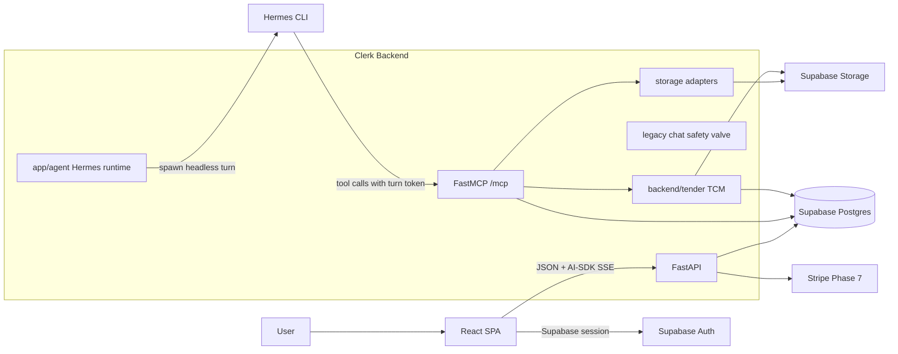

# Clerk Architecture

## Purpose

Clerk is the hosted SiteWise product repo. FastAPI remains the system of record;
Hermes becomes the reasoning runtime behind Clerk's chat; Tender Comparison is
the flagship workflow that proves the pattern.

The architecture is governed by the July Hermes Foundation plans. Older SEC,
Railway, local-first, and Practice Intelligence migration docs are historical
only if they still exist in git history.

## Canonical Direction

1. Phase 2 lands the MCP-over-HTTP tool bridge with per-turn HMAC tokens.
2. Phase 3 adds `backend/app/agent/` for Hermes invocation, streaming relay,
   sessions, bounded concurrency, and cancellation.
3. Phase 4 extends the existing Vercel AI SDK chat UI with tool chips, stop,
   session management, and artefact cards.
4. Phase 5 makes Tender Comparison run from natural-language chat through TCM
   and back into the comparison panel plus an editable report artefact.
5. Phase 6 completes workspace/document/artefact editing with Supabase Storage
   as canonical source storage and traversal-safe scratch paths for the agent.
6. Phase 7 swaps Polar to Stripe behind the entitlement seam and adds quotas.
7. Phase 8 deploys to `sitewise.au` through Dokploy and removes legacy runtime
   code after production acceptance passes.

## High-Level Shape

## Core Modules

- `backend/app/api/`: FastAPI routes for auth, chat, projects, billing, config,
  and mounted module routers.
- `backend/app/agent/`: Phase 3 Hermes process wrapper, SSE relay, concurrency,
  cancellation, and workspace path helpers.
- `backend/app/mcp_bridge/`: Phase 2 FastMCP server, turn-token mint/verify, and
  tool-layer project authorization.
- `backend/tender/`: Tender Comparison Module. It owns `tender_*` tables and
  schema-oriented extraction/comparison logic.
- `backend/app/storage/`: Supabase Storage helpers for canonical uploaded files.
- `backend/app/chat/` and `backend/app/assistant/`: legacy grounded-RAG path kept
  until Phase 8.5 cutover.
- `frontend/src/components/chat/`: Vercel AI SDK chat surface extended by Phase
  4.
- `frontend/src/components/project/tender/`: Tender Comparison dashboard panels.

## Streaming Contract

The frontend chat uses `@ai-sdk/react` and `DefaultChatTransport`. The backend
must emit the existing AI-SDK-compatible SSE vocabulary:

- `start`
- `text-start`
- `text-delta`
- `text-end`
- `data-clerk-status`
- `source-document`
- `finish`
- `[DONE]`

Phase 3's Hermes relay must preserve this contract so Phase 4 frontend work is
additive. Tool progress and artefact cards travel as `data-clerk-status` events.

## Storage Model

Canonical project files live in Supabase Storage, tracked by `workspace_files`.
Hermes does not receive raw filesystem access to user PDFs.

The agent reaches documents through tools such as `search_documents`,
`get_document`, and `list_selected_documents`. The filesystem `cwd` used by
Hermes is a scoped scratch/artefact directory on the VPS volume, not the source
document store. `draft_artifacts` remains authoritative for editable artefacts.

## TCM Interface

TCM is a module with a narrow interface:

- FastAPI router under `/api/tender`
- MCP tools for agent use, such as `start_tender_comparison`,
  `get_comparison_status`, and `get_comparison_result`
- SQLAlchemy models and Alembic migrations for `tender_*` tables

TCM does not use Clerk's RAG chunking pipeline. It shares upload/storage and
project ownership only. LLMs classify and map; deterministic Python performs all
math, totals, deltas, comparables, percentages, and benchmark calculations.

## Billing

Polar exists in the current codebase and remains a safety valve until Phase 7.
Phase 7 adds Stripe Checkout, Customer Portal, webhook sync, entitlement reads,
and monthly agent quota checks behind the existing
`require_active_entitlement(session, user)` seam.

Do not add a second entitlement seam.

## Deployment

The production target is `sitewise.au` on a VPS managed through Dokploy:

- `sitewise-api`: FastAPI backend image, later including Hermes CLI, JVM/ODL,
  MCP, and an agent workspace volume.
- `sitewise-web`: static React SPA served through nginx.
- Supabase remains hosted and external.
- nginx must keep SSE unbuffered.

Phase 8 validates Hermes, MCP, SSE, ODL, worker draining, billing, and the full
flagship workflow on Linux before legacy code is deleted.

## Deletion Rules

Do not delete these before Phase 8.5:

- `backend/app/chat/orchestrator.py`
- `backend/app/assistant/*`
- Polar billing modules, migrations, env examples, and repair scripts
- old cockpit pages/routes still used as safety valves

After the Phase 8 production acceptance gate passes, remove them in small,
revertable commits with the full backend and frontend checks green.

