# SiteWise — System Architecture

> **An evidence-grounded agentic system for construction project delivery.**
> Built for architects, project managers, superintendents and engineering
> practices who need documents that stand up in a contract dispute — not a
> chatbot that sounds confident.

`clerk` is the hosted product repository for **SiteWise** (`sitewise.au`).
FastAPI is the system of record, a headless CLI agent is the reasoning runtime,
and every capability the agent can reach is exposed through a single authorised
tool bridge.

---

## 0. Reader's map

| If you are… | Read |
| --- | --- |
| Evaluating the product | §1 Positioning, §2 Design thesis, §7 Capability catalogue |
| An architect / engineer assessing rigour | §2 Design thesis, §6 Knowledge planes, §8 Hybrid generation, §9 Tender Comparison |
| An engineer joining the codebase | §3 Container view, §4 Turn lifecycle, §5 Tool bridge, §10 Durable workflows |
| Reviewing security or tenancy | §5 Tool bridge, §13 Trust boundaries |
| Operating production | §14 Deployment, §15 Observability |
| Confused by a term | §17 Glossary |

---

## 1. Positioning

Construction management runs on documents: project management plans, cost
plans, RFPs, EOIs, tender packages, comparison reports. Each one is a synthesis
of scattered evidence — a geotech report, a DA consent, a schedule of finishes,
six subcontractor quotes — assembled under a professional standard of care.

Generic LLM assistants fail at this in a specific and predictable way. They
produce fluent prose that *reads* like a cost plan while inventing the numbers,
the site address, and the clause references. In a domain where the output is a
contract instrument, fluency without provenance is a liability, not a feature.

SiteWise is built on the inverse assumption:

> **The model is a language interface and a classifier. It is never the
> calculator, and it is never the source of a fact.**

Every number in a SiteWise cost plan is computed in Python. Every claim in a
SiteWise PMP is traceable to an ingested source document or to versioned
platform doctrine. Every artefact carries a revision, a snapshot fingerprint,
and an evidence ledger.

### What that buys you

| Capability | What it means in practice |
| --- | --- |
| **Evidence-grounded drafting** | Draft a PMP, cost plan or RFP from your uploaded project documents, with an evidence coverage register annexed to the output. |
| **Deterministic arithmetic** | Totals, deltas, contingency, escalation, %-of-cost consultant fees and benchmark comparisons are Python, not token prediction. |
| **Durable, resumable workflows** | Long-running generation survives restarts, deploys and disconnects. Idempotency keys prevent double-billing and duplicate artefacts. |
| **Tender comparison at line-item resolution** | Census-verified extraction and LLM adjudication map every quote line into a shared trade taxonomy, then reconcile against the quote's own stated totals. |
| **Revision-safe collaboration** | Optimistic concurrency on the project snapshot: a workflow launched against a stale profile is rejected, not silently wrong. |
| **A conversation that can act** | Natural language queues real workflows, edits the cost plan, proposes profile corrections, and streams progress — through an authorised tool surface, never raw database or shell access. |

---

## 2. Design thesis: the determinism boundary

The single most important line in this architecture is the boundary between
**stochastic** and **deterministic** components.

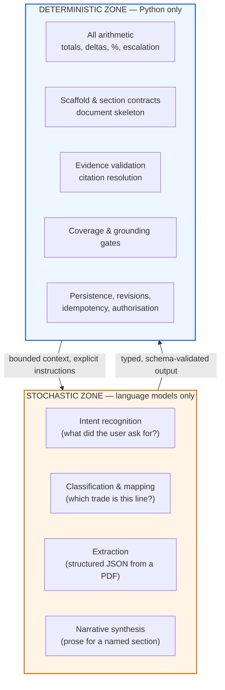
```mermaid
flowchart TB
    subgraph stoch["STOCHASTIC ZONE — language models only"]
        direction LR
        s1["Intent recognition<br/>(what did the user ask for?)"]
        s2["Classification & mapping<br/>(which trade is this line?)"]
        s3["Extraction<br/>(structured JSON from a PDF)"]
        s4["Narrative synthesis<br/>(prose for a named section)"]
    end

    subgraph det["DETERMINISTIC ZONE — Python only"]
        direction LR
        d1["All arithmetic<br/>totals, deltas, %, escalation"]
        d2["Scaffold & section contracts<br/>document skeleton"]
        d3["Evidence validation<br/>citation resolution"]
        d4["Coverage & grounding gates"]
        d5["Persistence, revisions,<br/>idempotency, authorisation"]
    end

    stoch -->|"typed, schema-validated output"| det
    det -->|"bounded context, explicit instructions"| stoch

    style stoch fill:#fff4e6,stroke:#d97706,stroke-width:2px
    style det fill:#eef6ff,stroke:#2563eb,stroke-width:2px
```

Three rules follow, and they are enforced structurally rather than by
convention:

1. **A model never computes.** LLM output crosses the boundary as a validated
   Pydantic model. Numbers in that payload are inputs to be checked, never
   results to be trusted. Arithmetic lives in `app/cost_plan/calculations.py`,
   `tender/services/totals.py`, `tender/services/reconciliation.py`.
2. **A model never gets ambient authority.** The agent has no filesystem access
   to source documents, no database connection, and no shell. It has a list of
   tools, and every tool call is independently authorised against a
   short-lived, project-scoped token (§5).
3. **A model never asserts an unsourced fact.** Generated sections pass through
   evidence validation and, where the section contract demands it, a coverage
   gate that checks the required corpus was actually consulted
   (`app/sitewise/pmp_coverage.py`, `app/sitewise/pmp_evidence_validation.py`).

Everything else in this document is machinery in service of those three rules.

---

## 3. System views

### 3.1 Context

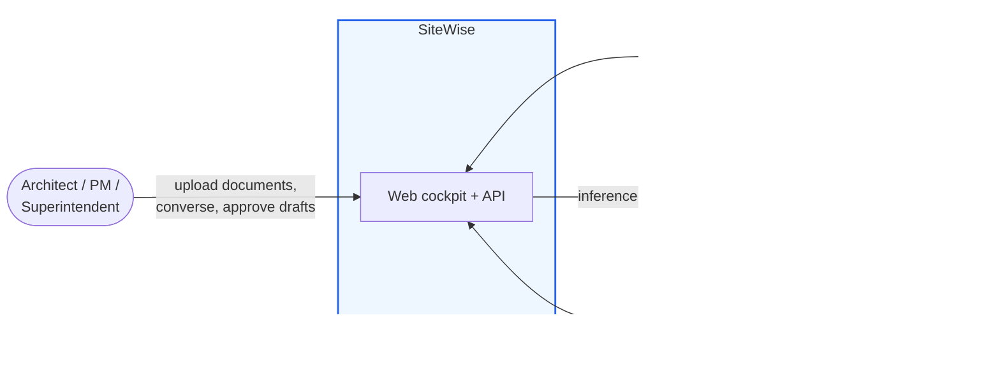
```mermaid
flowchart LR
    user(["Architect / PM /<br/>Superintendent"])

    subgraph sw["SiteWise"]
        app["Web cockpit + API"]
    end

    supa[("Supabase<br/>Postgres · Auth · Storage")]
    llm["LLM providers<br/>OpenAI · platform-key routing"]
    stripe["Stripe<br/>billing & entitlements"]

    user -->|"upload documents,<br/>converse, approve drafts"| app
    app <--> supa
    app -->|"inference, embeddings"| llm
    app <--> stripe

    style sw fill:#eef6ff,stroke:#2563eb,stroke-width:2px
```

### 3.2 Containers

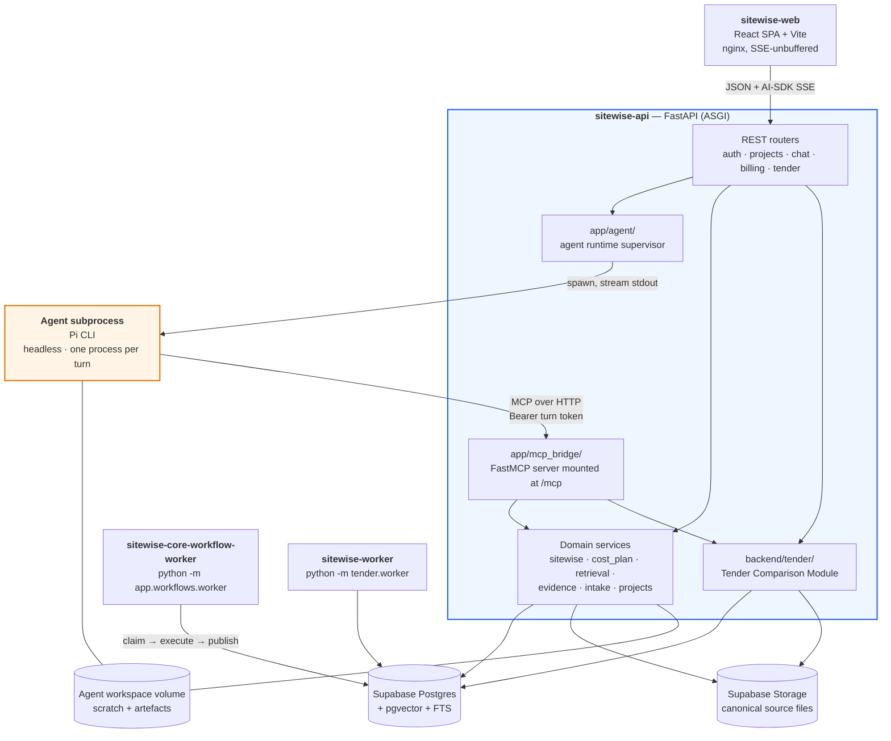
```mermaid
flowchart TB
    web["<b>sitewise-web</b><br/>React SPA + Vite<br/>nginx, SSE-unbuffered"]

    subgraph api["<b>sitewise-api</b> — FastAPI (ASGI)"]
        routes["REST routers<br/>auth · projects · chat · billing · tender"]
        agentrt["app/agent/<br/>agent runtime supervisor"]
        mcp["app/mcp_bridge/<br/>FastMCP server mounted at /mcp"]
        core["Domain services<br/>sitewise · cost_plan · retrieval ·<br/>evidence · intake · projects"]
        tcm["backend/tender/<br/>Tender Comparison Module"]
    end

    cli["<b>Agent subprocess</b><br/>Pi CLI<br/>headless · one process per turn"]

    wfw["<b>sitewise-core-workflow-worker</b><br/>python -m app.workflows.worker"]
    tw["<b>sitewise-worker</b><br/>python -m tender.worker"]

    pg[("Supabase Postgres<br/>+ pgvector + FTS")]
    obj[("Supabase Storage<br/>canonical source files")]
    vol[("Agent workspace volume<br/>scratch + artefacts")]

    web -->|"JSON + AI-SDK SSE"| routes
    routes --> agentrt
    agentrt -->|"spawn, stream stdout"| cli
    cli -->|"MCP over HTTP<br/>Bearer turn token"| mcp
    mcp --> core
    mcp --> tcm
    routes --> core
    routes --> tcm

    core --> pg
    core --> obj
    tcm --> pg
    tcm --> obj
    cli --- vol
    core --- vol

    wfw -->|"claim → execute → publish"| pg
    tw --> pg

    style api fill:#eef6ff,stroke:#2563eb,stroke-width:2px
    style cli fill:#fff4e6,stroke:#d97706,stroke-width:2px
```

**Why the agent is a subprocess.** The reasoning runtime is a headless CLI
(`pi`) spawned per turn, not an in-process SDK loop. That choice
buys hard isolation: the agent inherits no database handle, no Supabase
credential and no application object graph. Its entire capability surface is
the MCP endpoint it is handed, and its entire authority is the token in its
environment. Cancellation is a process-tree kill (`app/agent/process_tree.py`),
not a cooperative flag that may or may not be observed.

### 3.3 Module map

| Path | Responsibility |
| --- | --- |
| `app/api/` | HTTP surface: auth, projects, chat/agent streaming, billing, config |
| `app/agent/` | Pi subprocess supervision, prompt assembly, SSE relay, concurrency, cancellation |
| `app/mcp_bridge/` | FastMCP server, turn-token mint/verify, per-call project authorisation |
| `app/web_research/` | Official-source search, URL safety, bounded HTML/PDF extraction, provenance |
| `app/workflows/` | Durable run engine + workflow implementations (PMP, cost plan, procurement, ingest, sort) |
| `app/sitewise/` | Domain intelligence: taxonomy, section contracts, assemblers, renderers, evidence ledgers, coverage gates, knowledge catalog |
| `app/cost_plan/` | Cost model, deterministic calculations, workbook rendering |
| `app/retrieval/` | Hybrid retrieval: embeddings, FTS, fusion, routing, whole-document path |
| `app/evidence/`, `app/intake/`, `app/inbox/`, `app/document_intake/` | Upload, split, classify, OCR-detect, ingest, register |
| `app/projects/` | Snapshot, profile, decisions, identity, capabilities, artefact adapters, activity events |
| `app/billing/` | Stripe entitlements, monthly quota, mutation-scope reservation |
| `backend/tender/` | Tender Comparison Module — isolated, owns only `tender_*` tables |
| `frontend/src/` | React cockpit: chat, workspace explorer, workflow panels, tender matrix |

---

## 4. The agent turn lifecycle

A "turn" is one user message producing one streamed assistant response, plus
whatever tool calls, mutations and queued workflows it triggers. It is the
central control loop of the product.

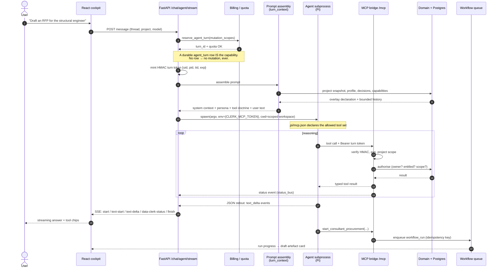
```mermaid
sequenceDiagram
    autonumber
    actor U as User
    participant W as React cockpit
    participant A as FastAPI /chat/agent/stream
    participant B as Billing / quota
    participant P as Prompt assembly<br/>(turn_context)
    participant R as Agent subprocess<br/>(Pi)
    participant M as MCP bridge /mcp
    participant D as Domain + Postgres
    participant Q as Workflow queue

    U->>W: "Draft an RFP for the structural engineer"
    W->>A: POST message (thread, project, model)

    A->>B: reserve_agent_turn(mutation_scopes)
    B-->>A: turn_id + quota OK
    Note over A,B: A durable agent_turn row IS the capability.<br/>No row → no mutation, ever.

    A->>A: mint HMAC turn token {uid, pid, tid, exp}
    A->>P: assemble prompt
    P->>D: project snapshot, profile, decisions, capabilities
    D-->>P: overlay declaration + bounded history
    P-->>A: system context + persona + tool doctrine + user text

    A->>R: spawn(argv, env={CLERK_MCP_TOKEN}, cwd=scoped workspace)
    Note over R: .pi/mcp.json declares the allowed tool set

    loop reasoning
        R->>M: tool call + Bearer turn token
        M->>M: verify HMAC, exp, project scope
        M->>D: authorise (owner? entitled? scope?)
        D-->>M: result
        M-->>R: typed tool result
        M-->>A: status event (status_bus)
    end

    R-->>A: JSON stdout: text_delta events
    A-->>W: SSE: start / text-start / text-delta / data-clerk-status / finish
    W-->>U: streaming answer + tool chips

    R->>M: start_consultant_procurement(...)
    M->>Q: enqueue workflow_run (idempotency key)
    Q-->>W: run progress → draft artefact card
```

### 4.1 Pi runtime and model selection

Pi is the sole reasoning runtime. It is launched stateless for every turn;
continuity remains in Clerk's bounded, inspectable Postgres-backed prompt
context rather than a CLI session cache.

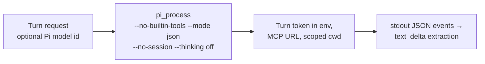
```mermaid
flowchart LR
    req["Turn request<br/>optional Pi model id"] --> p["pi_process<br/>--no-builtin-tools --mode json<br/>--no-session --thinking off"]
    p --> tok["Turn token in env,<br/>MCP URL, scoped cwd"]
    tok --> stream["stdout JSON events →<br/>text_delta extraction"]
```

Pi receives a `directTools` allowlist in `.pi/mcp.json`, so it reaches only
the Clerk domain tools deliberately exposed for the product workflow.

### 4.2 Prompt assembly

`app/agent/turn_context.py` is deliberately boring: **string assembly only —
bounded, deterministic, no retrieval, no LLM calls.** The agent is headless and
re-spawned every turn, so everything it needs beyond the user's words must
travel in the prompt.

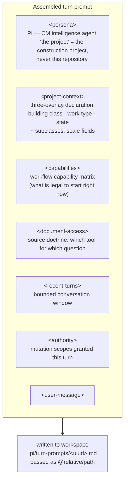
```mermaid
flowchart TB
    subgraph prompt["Assembled turn prompt"]
        persona["&lt;persona&gt;<br/>Pi — CM intelligence agent.<br/>'the project' = the construction project,<br/>never this repository."]
        ctx["&lt;project-context&gt;<br/>three-overlay declaration:<br/>building class · work type · state<br/>+ subclasses, scale fields"]
        caps["&lt;capabilities&gt;<br/>workflow capability matrix<br/>(what is legal to start right now)"]
        doc["&lt;document-access&gt;<br/>source doctrine: which tool for which question"]
        hist["&lt;recent-turns&gt;<br/>bounded conversation window"]
        auth["&lt;authority&gt;<br/>mutation scopes granted this turn"]
        user["&lt;user-message&gt;"]
    end
    prompt --> file["written to workspace<br/>.pi/turn-prompts/&lt;uuid&gt;.md<br/>passed as @relative/path"]
```

The prompt is written to a file inside the scoped workspace and passed by
reference. This sidesteps command-line length limits and shell quoting entirely
— an injection surface that argv-passed prompts leave open.

### 4.3 Streaming contract

The frontend uses `@ai-sdk/react` with `DefaultChatTransport`. The backend
emits the AI-SDK SSE vocabulary, and `app/agent/sse_relay.py` multiplexes two
independent async iterators — model text and tool status — into that single
ordered stream.

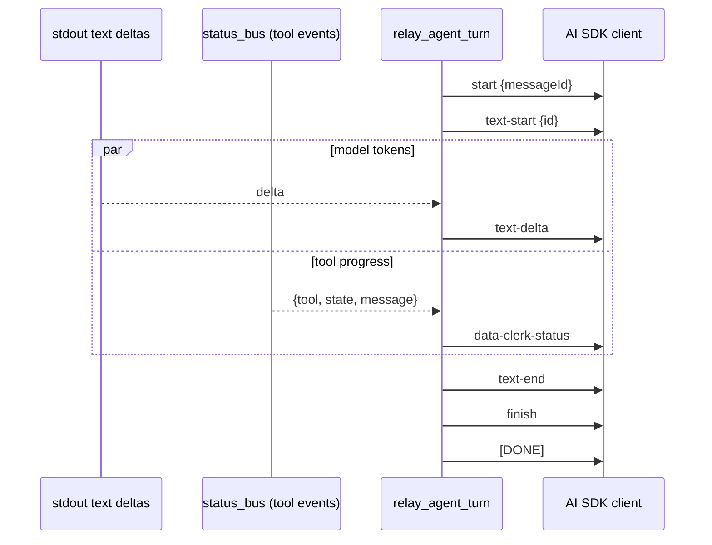
```mermaid
sequenceDiagram
    participant Text as stdout text deltas
    participant Status as status_bus (tool events)
    participant Relay as relay_agent_turn
    participant Client as AI SDK client

    Relay->>Client: start {messageId}
    Relay->>Client: text-start {id}
    par model tokens
        Text-->>Relay: delta
        Relay->>Client: text-delta
    and tool progress
        Status-->>Relay: {tool, state, message}
        Relay->>Client: data-clerk-status
    end
    Relay->>Client: text-end
    Relay->>Client: finish
    Relay->>Client: [DONE]
```

`asyncio.wait(FIRST_COMPLETED)` on both tasks means a long-running tool call
never blocks token flow, and a token burst never starves progress updates.
Failure on either stream cancels its sibling and emits a terminal error frame —
the client is never left hanging on a half-open stream.

### 4.4 Concurrency and cancellation

`AgentTurnRegistry` (`app/agent/concurrency.py`) enforces a global semaphore
plus a one-live-turn-per-thread invariant.

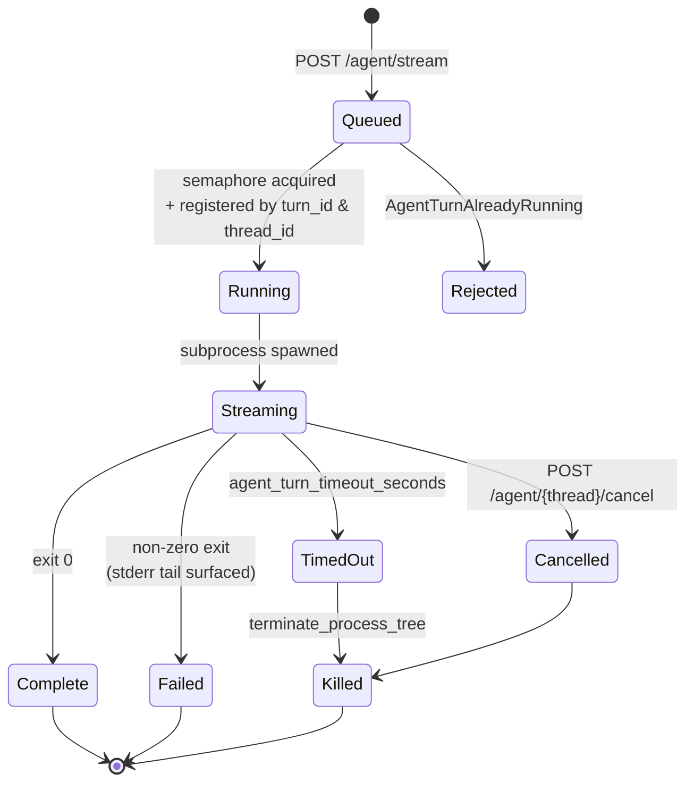
```mermaid
stateDiagram-v2
    [*] --> Queued: POST /agent/stream
    Queued --> Running: semaphore acquired<br/>+ registered by turn_id & thread_id
    Queued --> Rejected: AgentTurnAlreadyRunning
    Running --> Streaming: subprocess spawned
    Streaming --> Complete: exit 0
    Streaming --> Failed: non-zero exit<br/>(stderr tail surfaced)
    Streaming --> TimedOut: agent_turn_timeout_seconds
    Streaming --> Cancelled: POST /agent/{thread}/cancel
    TimedOut --> Killed: terminate_process_tree
    Cancelled --> Killed
    Complete --> [*]
    Failed --> [*]
    Killed --> [*]
```

Cancellation and timeout both terminate the **process group**, not just the
parent PID. A CLI agent that has spawned its own child processes cannot orphan
work that keeps burning tokens after the user pressed stop.

---

## 5. The tool bridge — capability-scoped agent authority

This is the security seam. The header comment in `app/mcp_bridge/auth.py` reads
*"every tool call is authorized per project. Never bypass."*

### 5.1 Token model

```mermaid
flowchart TB
    subgraph mint["At turn start — FastAPI"]
        r["reserve_agent_turn()<br/>→ agent_turn row<br/>+ mutation_scopes[]"]
        t["mint_turn_token()<br/>HMAC-SHA256 over<br/>{uid, pid, tid, exp}"]
        r --> t
    end

    t -->|"env: CLERK_MCP_TOKEN"| agent["Agent subprocess"]
    agent -->|"Authorization: Bearer …"| call["Tool call"]

    subgraph verify["Per call — MCP bridge"]
        v1["verify HMAC signature"]
        v2["check exp (turn timeout + 30s)"]
        v3["claims.project_id == requested project_id"]
        v4["user_owns_project()"]
        v5{"mutating tool?"}
        v6["require_active_mutation_turn()<br/>turn row live? scope granted?<br/>patch within declared bounds?"]
        v1 --> v2 --> v3 --> v4 --> v5
        v5 -->|yes| v6
        v5 -->|no| ok(["execute"])
        v6 --> ok
    end

    call --> v1

    style verify fill:#eef6ff,stroke:#2563eb,stroke-width:2px
```

Four properties worth naming:

- **Short-lived.** TTL is the turn timeout plus 30 seconds. A leaked token is
  worthless within a minute.
- **Project-bound.** The token carries the project id. A tool call naming a
  different project is rejected before any query runs — cross-tenant access is
  structurally impossible, not policy-dependent.
- **Revocable mid-turn.** Read authority lives in the token; *write* authority
  lives in a database row. `revoke_agent_turn()` kills every mutation the
  subprocess can still attempt, even though the token is cryptographically
  valid.
- **Scope-limited.** Mutation scopes (e.g. `profile_mutation`) are reserved at
  turn start from analysed user intent (`app/agent/mutation_intent.py`). A turn
  whose text was a question cannot become a turn that rewrites the project
  profile.

### 5.2 Mutation intent — earning the right to write

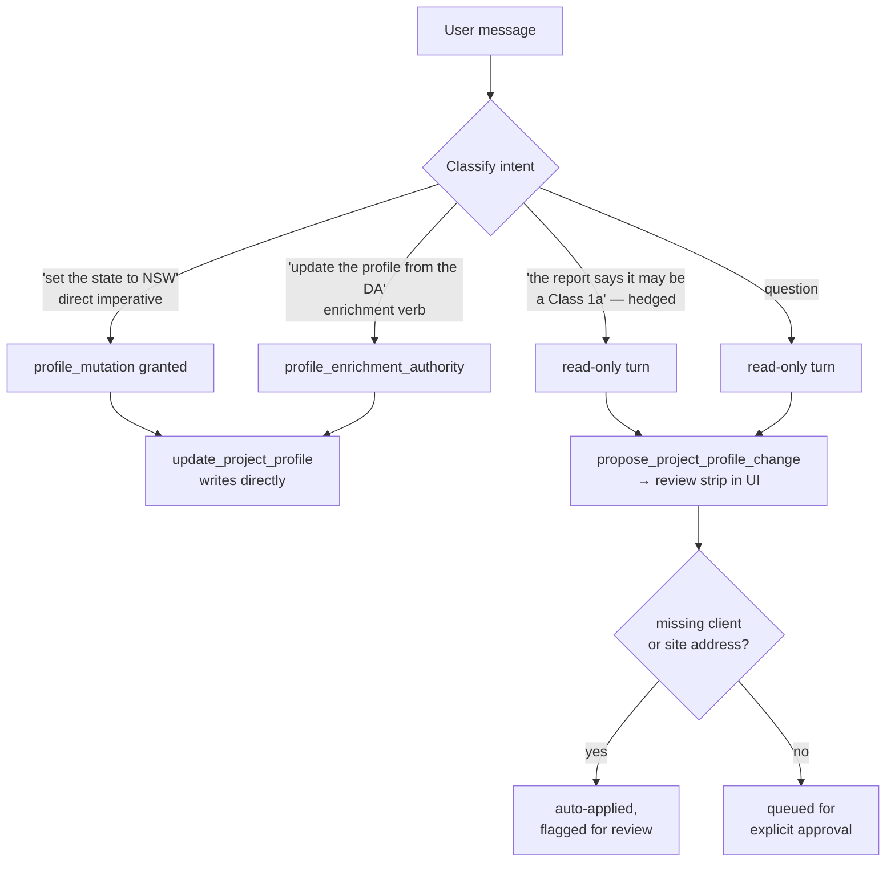
```mermaid
flowchart TB
    msg["User message"] --> cls{"Classify intent"}
    cls -->|"'set the state to NSW'<br/>direct imperative"| direct["profile_mutation granted"]
    cls -->|"'update the profile from the DA'<br/>enrichment verb"| enrich["profile_enrichment_authority"]
    cls -->|"'the report says it may be<br/>a Class 1a' — hedged"| propose["read-only turn"]
    cls -->|"question"| ro["read-only turn"]

    direct --> apply["update_project_profile<br/>writes directly"]
    enrich --> apply
    propose --> prop["propose_project_profile_change<br/>→ review strip in UI"]
    ro --> prop

    prop --> auto{"missing client<br/>or site address?"}
    auto -->|yes| autoapply["auto-applied,<br/>flagged for review"]
    auto -->|no| queue["queued for<br/>explicit approval"]
```

Hedged, quoted, or single-document claims degrade to a **proposal** rather than
a write. The one deliberate exception — a missing client name or site address —
auto-applies and marks the profile for review, because those two fields block
every procurement artefact downstream and stalling on them wastes the user's
time for no safety gain.

### 5.3 Tool surface

56 tools, grouped by the domain they open. This *is* the agent's world model —
it can do these things and nothing else.

| Group | Tools |
| --- | --- |
| **Project state** | `get_project_profile`, `get_project_profile_options`, `get_project_snapshot`, `get_project_next_actions`, `get_workflow_capabilities` |
| **Profile mutation** | `update_project_profile`, `propose_project_profile_change`, `accept_project_profile_proposal`, `reject_project_profile_proposal` |
| **Decisions** | `list_project_decisions`, `get_project_decision`, `update_project_decision`, `lock_project_decision`, `unlock_project_decision` |
| **Workflow control** | `start_project_plan`, `refresh_project_plan`, `start_cost_plan`, `refresh_cost_plan`, `sort_project_files`, `start_consultant_procurement`, `start_contractor_eoi`, `start_trade_procurement`, `get_project_workflow_status`, `get_project_workflow_result`, `cancel_project_workflow` |
| **Cost plan** | `get_cost_plan`, `upsert_cost_item`, `set_contingency`, `set_cost_plan_assumption`, `forecast_consultant_fees`, `apply_consultant_fee_forecast`, `apply_cost_plan_budget_forecast`, `apply_approved_tender_to_cost_plan` |
| **Tender comparison** | `list_tender_comparisons`, `get_tender_comparison`, `start_tender_comparison`, `prepare_tender_comparison`, `get_comparison_status`, `get_comparison_result`, `find_candidate_tender_documents`, `get_tender_quote_selection`, `replace_tender_quote_selection` |
| **Project evidence** | `find_document_text`, `search_documents`, `get_document` |
| **Platform knowledge** | `list_platform_knowledge`, `search_platform_knowledge`, `read_platform_knowledge` |
| **Official web research** | `search_web`, `read_web_source` |
| **Workspace / artefacts** | `list_project_files`, `list_workspace`, `read_workspace_file`, `write_workspace_file`, `read_project_workbook`, `draft_consultant_procurement_artifact` |

Note what is absent: no SQL, no shell, no `read_file` on an arbitrary path, and no
arbitrary network fetch. Web access is feature-gated and limited to official
Australian government HTTPS sources; every URL and redirect is validated before
bounded HTML/PDF extraction. Filesystem tools resolve through `app/agent/workspace_paths.py`
against a per-project scratch root — traversal-safe by construction, and
pointing at generated artefacts rather than at the canonical document store.

---

## 6. Knowledge architecture — four planes

Retrieval-augmented generation in most products is a single vector index. That
conflates epistemically different things. SiteWise separates them and
makes the agent declare which plane it is drawing on.

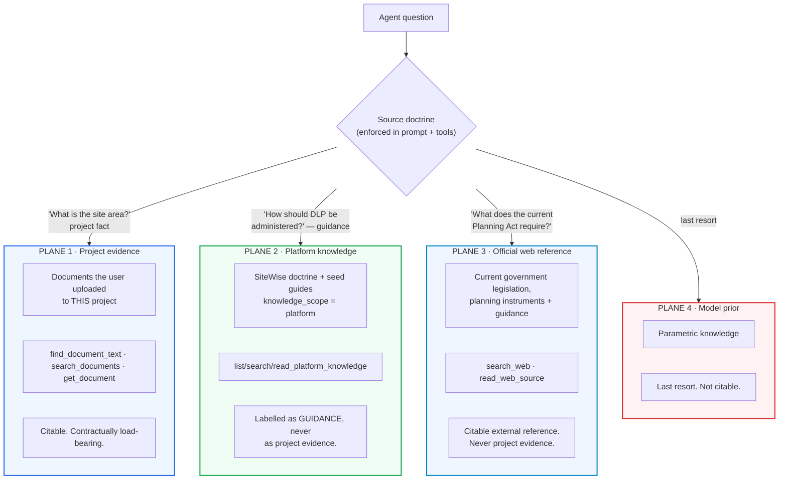
```mermaid
flowchart TB
    q["Agent question"] --> route{"Source doctrine<br/>(enforced in prompt + tools)"}

    route -->|"'What is the site area?'<br/>project fact"| pe
    route -->|"'How should DLP be<br/>administered?' — guidance"| pk
    route -->|"'What does the current<br/>Planning Act require?'"| wr
    route -->|last resort| mp

    subgraph pe["PLANE 1 · Project evidence"]
        pe1["Documents the user uploaded<br/>to THIS project"]
        pe2["find_document_text · search_documents · get_document"]
        pe3["Citable. Contractually load-bearing."]
    end

    subgraph pk["PLANE 2 · Platform knowledge"]
        pk1["SiteWise doctrine + seed guides<br/>knowledge_scope = platform"]
        pk2["list/search/read_platform_knowledge"]
        pk3["Labelled as GUIDANCE, never<br/>as project evidence."]
    end

    subgraph wr["PLANE 3 · Official web reference"]
        wr1["Current government legislation,<br/>planning instruments + guidance"]
        wr2["search_web · read_web_source"]
        wr3["Citable external reference.<br/>Never project evidence."]
    end

    subgraph mp["PLANE 4 · Model prior"]
        mp1["Parametric knowledge"]
        mp2["Last resort. Not citable."]
    end

    style pe fill:#eef6ff,stroke:#2563eb,stroke-width:2px
    style pk fill:#f0fdf4,stroke:#16a34a,stroke-width:2px
    style wr fill:#eff6ff,stroke:#0284c7,stroke-width:2px
    style mp fill:#fef2f2,stroke:#dc2626,stroke-width:2px
```

Platform knowledge is ingested **once**, globally, as `sitewise-platform`
reference rows — never copied into a project, never stored as
`project_evidence`. That single rule prevents the failure mode where a generic
NCC guide gets retrieved as if it were the project's own fire engineering
report.

Official web references remain external and are not ingested into the project
corpus. The answer trace records their canonical URL, publisher, jurisdiction,
authority class, version status, effective date, retrieval timestamp, excerpt,
and content hash in `message_web_citations`. Search results alone do not count as
a source; Pi must call `read_web_source` before the globe trace appears.

The initial discovery adapter is `nsw_legislation`: a keyless, curated registry
of stable `legislation.nsw.gov.au` current-document URLs covering core NSW Acts,
regulations, and environmental planning instruments. Discovery ranks that
registry locally; `read_web_source` still retrieves the live authoritative page
before Pi may rely on it. `brave` remains an optional configured provider for
broader official-government discovery and requires its own API key.

Production acceptance for an official-source adapter must include a successful
live read from the deployed API service's egress IP. If an authority presents a
browser-verification or bot-protection challenge, the adapter fails explicitly;
Clerk does not automate around that control. Obtain sanctioned machine access or
an allowlisting arrangement from the publishing authority before enabling that
source in production.

### 6.1 Platform knowledge catalog

`app/sitewise/knowledge_catalog.py` builds a frontmatter-driven catalog over
`data/seed/` and `data/skills/reference/`. Each entry declares its
applicability, so retrieval can be narrowed by project shape before any
embedding is compared:

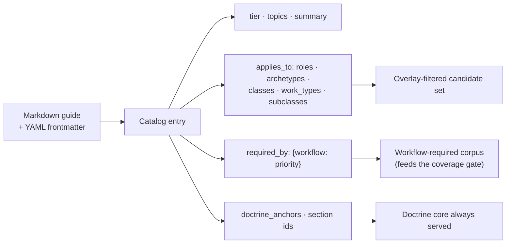
```mermaid
flowchart LR
    md["Markdown guide<br/>+ YAML frontmatter"] --> parse["Catalog entry"]
    parse --> f1["tier · topics · summary"]
    parse --> f2["applies_to: roles · archetypes ·<br/>classes · work_types · subclasses"]
    parse --> f3["required_by: {workflow: priority}"]
    parse --> f4["doctrine_anchors · section ids"]

    f2 --> filt["Overlay-filtered candidate set"]
    f3 --> req["Workflow-required corpus<br/>(feeds the coverage gate)"]
    f4 --> anchor["Doctrine core always served"]
```

`required_by` is the interesting one: a guide can declare *"the create-cost-plan
workflow must consult me, at priority 2."* That declaration is what the
coverage gate later checks against (§8.3) — the corpus tells the workflow what
it owes, rather than the workflow hardcoding a list.

### 6.2 Document ingest pipeline

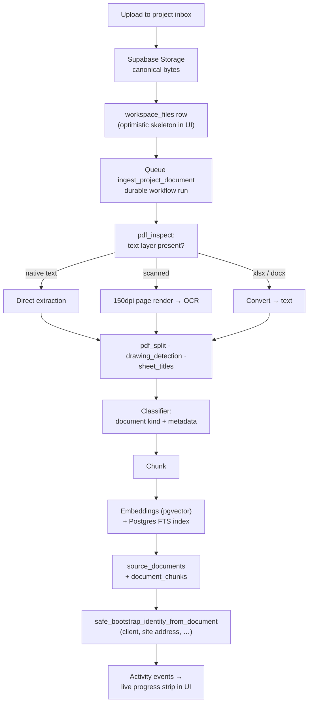
```mermaid
flowchart TB
    up["Upload to project inbox"] --> store["Supabase Storage<br/>canonical bytes"]
    store --> wf["workspace_files row<br/>(optimistic skeleton in UI)"]
    wf --> run["Queue ingest_project_document<br/>durable workflow run"]

    run --> insp["pdf_inspect:<br/>text layer present?"]
    insp -->|"native text"| txt["Direct extraction"]
    insp -->|"scanned"| ocr["150dpi page render → OCR"]
    insp -->|"xlsx / docx"| conv["Convert → text"]

    txt --> split
    ocr --> split
    conv --> split

    split["pdf_split · drawing_detection ·<br/>sheet_titles"] --> cls["Classifier:<br/>document kind + metadata"]
    cls --> chunk["Chunk"]
    chunk --> emb["Embeddings (pgvector)<br/>+ Postgres FTS index"]
    emb --> sd["source_documents<br/>+ document_chunks"]
    sd --> boot["safe_bootstrap_identity_from_document<br/>(client, site address, …)"]
    boot --> ev["Activity events →<br/>live progress strip in UI"]
```

Drawing sets get special handling: multi-sheet PDFs are split and sheet titles
extracted, so "show me the structural sheets" resolves against a real drawing
register instead of a soup of undifferentiated chunks.

### 6.3 Retrieval routing

Not every question wants a vector search. `app/retrieval/router.py` triages
first:

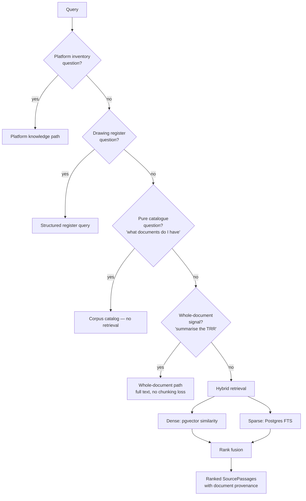
```mermaid
flowchart TB
    q["Query"] --> c1{"Platform inventory<br/>question?"}
    c1 -->|yes| pl["Platform knowledge path"]
    c1 -->|no| c2{"Drawing register<br/>question?"}
    c2 -->|yes| dr["Structured register query"]
    c2 -->|no| c3{"Pure catalogue<br/>question?<br/>'what documents do I have'"}
    c3 -->|yes| cat["Corpus catalog — no retrieval"]
    c3 -->|no| c4{"Whole-document<br/>signal?<br/>'summarise the TRR'"}
    c4 -->|yes| wd["Whole-document path<br/>full text, no chunking loss"]
    c4 -->|no| hyb["Hybrid retrieval"]

    hyb --> h1["Dense: pgvector similarity"]
    hyb --> h2["Sparse: Postgres FTS"]
    h1 --> fuse["Rank fusion"]
    h2 --> fuse
    fuse --> pass["Ranked SourcePassages<br/>with document provenance"]
```

The **whole-document path** matters more than it looks. "Summarise the tender
evaluation report" is a request about a document as an object, not about
passages within it. Chunk-and-rank retrieval answers that question badly by
construction; routing it to full-text retrieval answers it correctly.

---

## 7. Capability catalogue — what SiteWise actually produces

Every capability below is reachable three ways: a cockpit button, a natural
language request in chat, or a direct API call. All three converge on the same
durable workflow run.

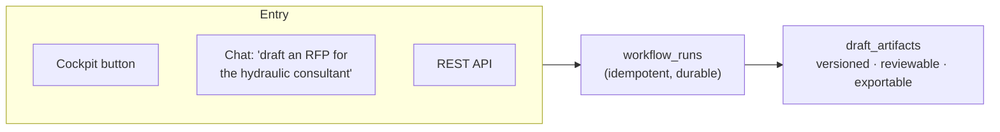
```mermaid
flowchart LR
    subgraph inputs["Entry"]
        b["Cockpit button"]
        c["Chat: 'draft an RFP for<br/>the hydraulic consultant'"]
        a["REST API"]
    end
    inputs --> wr["workflow_runs<br/>(idempotent, durable)"]
    wr --> out["draft_artifacts<br/>versioned · reviewable · exportable"]
```

| Workflow | Product framing | Key mechanics |
| --- | --- | --- |
| `create_project_plan` / `refresh_project_plan` | **Project Management Plan** — a full PMP drafted against your evidence, with an evidence coverage register annexed | Deterministic scaffold from section contracts → per-section narrative → assembler → evidence validation → coverage gate → citation ledger |
| `create_cost_plan` / `refresh_cost_plan` | **Elemental cost plan** with contingency, escalation, consultant fee forecast and a downloadable Excel workbook | Python arithmetic throughout; LLM writes narrative only; budget/consultant forecast models; workbook renderer |
| `consultant_procurement` | **Request for fee proposal** — scope of services, deliverables, fee schedule, per discipline | Identity facts resolved from profile → documents → proposal; refuses to invent an address or client |
| `contractor_eoi` | **Head contractor EOI** — unpriced expression of interest for main works | Explicitly separate from Tender Comparison; own capability gate |
| `trade_procurement` | **RFT / RFQ packages** for trade and supplier packages | `kind=rft` for tender language, `kind=rfq` for quotation language; drafting intent strictly separated from evaluation intent |
| `sort_project_files` | **Inbox triage** — classify and file uploaded documents into the project structure | Classifier + repair service; produces a reviewable sort result |
| `ingest_project_document` | **Make a document answerable** — text, OCR, chunking, embedding, registration | See §6.2 |
| Tender Comparison | **Line-item tender comparison** across bidders with benchmark analysis | See §9 |

### 7.1 The capability matrix — refusing to draft the wrong thing

`app/projects/workflow_capabilities.py` computes, from the current project
snapshot, exactly which workflows are legal right now and *why* the others are
not.

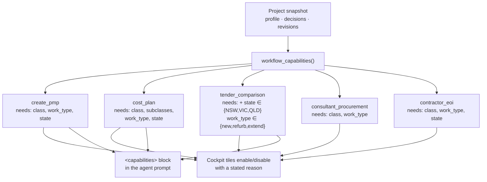
```mermaid
flowchart TB
    snap["Project snapshot<br/>profile · decisions · revisions"] --> mat["workflow_capabilities()"]

    mat --> pmp["create_pmp<br/>needs: class, work_type, state"]
    mat --> cp["cost_plan<br/>needs: class, subclasses,<br/>work_type, state"]
    mat --> tc["tender_comparison<br/>needs: + state ∈ {NSW,VIC,QLD}<br/>work_type ∈ {new,refurb,extend}"]
    mat --> con["consultant_procurement<br/>needs: class, work_type"]
    mat --> eoi["contractor_eoi<br/>needs: class, work_type, state"]

    pmp --> ui["Cockpit tiles enable/disable<br/>with a stated reason"]
    cp --> ui
    tc --> ui
    con --> ui
    eoi --> ui

    pmp --> prompt["&lt;capabilities&gt; block<br/>in the agent prompt"]
    cp --> prompt
    tc --> prompt
```

The same matrix drives the UI and the agent prompt. This closes a whole class
of agentic failure: the model cannot promise a deliverable the system will
refuse to produce, because the refusal reason is in its context before it
answers. A specific instance is called out in the prompt doctrine — the agent
must never borrow Tender Comparison's Class 1a coverage restriction as a reason
to decline a contractor EOI, because they are unrelated capabilities.

---

## 8. The hybrid generation pattern

This is the core intellectual property of the document workflows. It is how a
40-page PMP gets produced without the model inventing its own structure, its
own numbers, or its own evidence.

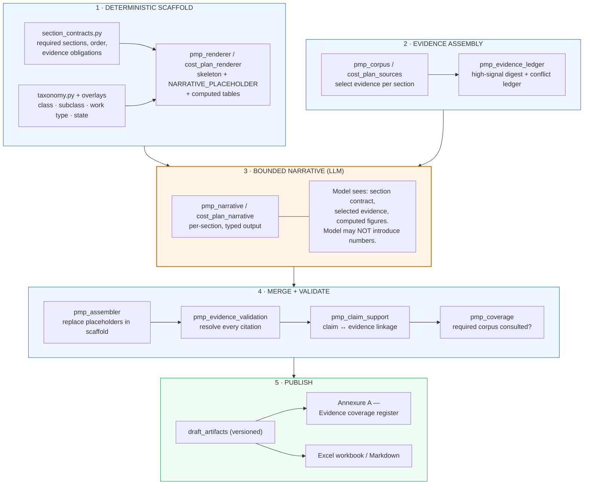
```mermaid
flowchart TB
    subgraph phase1["1 · DETERMINISTIC SCAFFOLD"]
        sc["section_contracts.py<br/>required sections, order,<br/>evidence obligations"]
        tax["taxonomy.py + overlays<br/>class · subclass · work type · state"]
        ren["pmp_renderer / cost_plan_renderer<br/>skeleton + NARRATIVE_PLACEHOLDER<br/>+ computed tables"]
        sc --> ren
        tax --> ren
    end

    subgraph phase2["2 · EVIDENCE ASSEMBLY"]
        corp["pmp_corpus / cost_plan_sources<br/>select evidence per section"]
        led["pmp_evidence_ledger<br/>high-signal digest + conflict ledger"]
        corp --> led
    end

    subgraph phase3["3 · BOUNDED NARRATIVE (LLM)"]
        nar["pmp_narrative / cost_plan_narrative<br/>per-section, typed output"]
        note["Model sees: section contract,<br/>selected evidence, computed figures.<br/>Model may NOT introduce numbers."]
        nar --- note
    end

    subgraph phase4["4 · MERGE + VALIDATE"]
        asm["pmp_assembler<br/>replace placeholders in scaffold"]
        val["pmp_evidence_validation<br/>resolve every citation"]
        cs["pmp_claim_support<br/>claim ↔ evidence linkage"]
        cov["pmp_coverage<br/>required corpus consulted?"]
        asm --> val --> cs --> cov
    end

    subgraph phase5["5 · PUBLISH"]
        art["draft_artifacts (versioned)"]
        anx["Annexure A —<br/>Evidence coverage register"]
        wb["Excel workbook / Markdown"]
        art --> anx
        art --> wb
    end

    phase1 --> phase3
    phase2 --> phase3
    phase3 --> phase4
    phase4 --> phase5

    style phase1 fill:#eef6ff,stroke:#2563eb
    style phase2 fill:#eef6ff,stroke:#2563eb
    style phase3 fill:#fff4e6,stroke:#d97706,stroke-width:2px
    style phase4 fill:#eef6ff,stroke:#2563eb
    style phase5 fill:#f0fdf4,stroke:#16a34a
```

### 8.1 Why a scaffold at all

Asking a model to "write a PMP" produces a plausible document with an invented
table of contents. Asking a model to "write section 4.2 Site Establishment,
given these seven evidence passages and this computed preliminaries total"
produces a section you can audit. The scaffold makes the document's *shape* a
property of the system rather than a property of the sample.

It also makes the output **diffable across revisions**. Two versions of a PMP
generated a month apart share a skeleton, so a reviewer sees what changed in
the argument, not what changed in the model's mood about headings.

### 8.2 Evidence ledger and conflict detection

`pmp_evidence_ledger.py` builds a *high-signal digest* — deduplicated, ranked
evidence — plus an explicit **conflict ledger**. When the geotech report and
the DA consent disagree about the site classification, that disagreement is
surfaced as a conflict for the user rather than silently resolved by whichever
passage happened to rank higher.

### 8.3 The coverage gate

`pmp_coverage.py` checks that the corpus a workflow *declared it required*
(§6.1, `required_by`) was actually consulted, and emits **Annexure A — Evidence
coverage register** into the document.

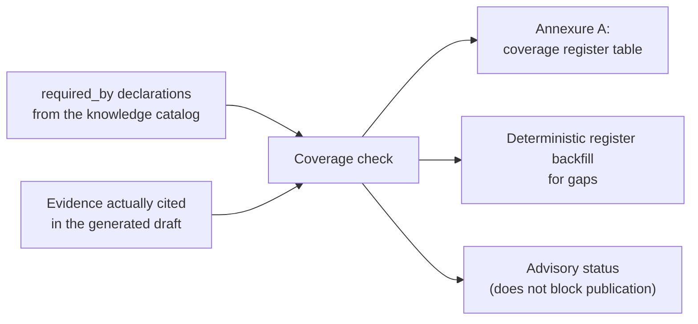
```mermaid
flowchart LR
    req["required_by declarations<br/>from the knowledge catalog"] --> chk["Coverage check"]
    used["Evidence actually cited<br/>in the generated draft"] --> chk
    chk --> reg["Annexure A:<br/>coverage register table"]
    chk --> back["Deterministic register backfill<br/>for gaps"]
    chk --> adv["Advisory status<br/>(does not block publication)"]
```

The gate is **advisory**, not blocking. A partially-covered draft with an honest
coverage register is more useful to a professional than no draft at all — the
register tells the reviewer exactly where to apply their own judgement. That is
a deliberate product decision about where human review belongs, not an
unfinished gate.

### 8.4 Bounded retrieval, exact briefs and combined-section validation

PMP, Cost Plan, consultant RFP and trade RFT/RFQ generation share one bounded
input contract. The artefact-specific context lens selects the lowest sufficient
`RetrievalLevel`; equivalent logical queries are deduplicated; and one
`RetrievalBudget` limits searches, chunks, documents, tokens, characters and
concurrency. Whole-document, corpus-sweep, supplemental and mandatory-guidance
inputs re-enter the same `GenerationEvidencePool` as preloaded evidence before
they reach a model. A structured-complete context therefore performs no semantic
search, while broader retrieval remains explicit and measurable.

Once the final evidence set is known, the workflow creates one frozen
`ArtefactGenerationBrief`. Every concurrent section prompt, block-generation
hash and persisted `GenerationManifest` uses that exact brief and fingerprint;
the manifest embeds the full brief rather than reconstructing a lossy summary
after generation.

The bounded section runner rejects duplicate job keys and gathers typed section
outputs concurrently. Before assembly, a shared consistency gate checks explicit
project and consultant identity claims, procurement-route terminology, dates,
and duplicate scope or risk items. Deterministic conflicts enter each workflow's
bounded retry loop. Only ambiguous near-duplicates reach one batched AI resolver,
and its call count is carried across rejected attempts into workflow trace or
procurement provenance.

### 8.5 Addressable Markdown and presentation boundaries

PMP, RFP and RFT drafts carry stable internal block identity for paragraphs,
list items and table body rows. Table headers and delimiter rows are structural
syntax, not editable blocks. Identity is encoded as an internal
`<!-- clerk:block id=... -->` comment: on its own line before a paragraph, as a
list-item suffix, or immediately after a table body row's closing pipe.

These comments are canonical editing metadata, not issue-document content.
Every presentation boundary must therefore do one of the following before a
Markdown parser sees the document:

- the web renderer replaces each marker with the same number of spaces so
  canonical source offsets remain stable;
- Word/PDF and other issued-output paths strip markers completely;
- deterministic Markdown transforms detach and reattach row markers while
  parsing or rebuilding cells.

Marker stripping is reversible for supported Markdown, including original line
endings and terminal-newline state. No issued document may contain a
`clerk:block` marker.

### 8.6 Artefact mutation contract

Manual UI, HTTP APIs and Pi MCP tools share one external operation vocabulary:

```text
ADD | UPDATE | DELETE | MOVE | DUPLICATE
```

Targets are typed (`paragraph`, `list_item`, `table_row`, `cost_item`,
`cost_category`). Domain-specific review and protection ops
(`PROTECT` / `UNPROTECT` / `KEEP` / `CONFIRM_DELETE`) remain on the block
surface only; they do not invent parallel synonym enums.

Supported write paths:

| Family | Mutation entry | Revision contract |
| --- | --- | --- |
| Narrative drafts (PMP/RFP/RFT) | `POST .../drafts/{id}/blocks` and MCP `apply_artefact_operations` | one draft revision per successful batch; response is an `ArtefactBlockDelta` |
| Cost Plan | `POST .../cost-plan/operations` and MCP `apply_cost_plan_operations` | one typed Cost Plan revision; workbook rebuild is coalesced and derived |
| Scratch workspace files | MCP `write_workspace_file` | scratch only — draft artefact whole-document Markdown writes are rejected |

Whole-document `PATCH .../drafts/{id}` is removed. AI tools must not rewrite
artefact Markdown as a single blob; they construct validated block or Cost Plan
operations instead. Legacy PydanticAI chat/orchestrator paths remain until the
Phase 8.5 cutover gate and are out of scope for this mutation simplification.

---

## 9. Tender Comparison Module

TCM is architecturally isolated: it lives in `backend/tender/`, owns only
`tender_*` tables, references core `projects` / `users` / `drafts` by foreign
key, and is reached from core only through a mounted router and MCP tool
adapters. It deliberately does **not** use the RAG chunking pipeline — tender
documents are structured commercial instruments, and schema-oriented extraction
beats semantic search for them.

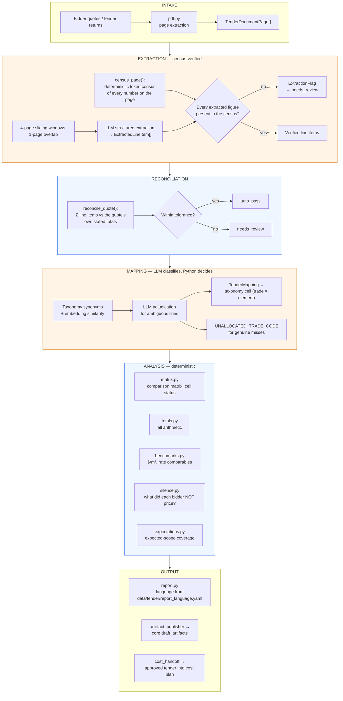
```mermaid
flowchart TB
    subgraph intake["INTAKE"]
        up["Bidder quotes / tender returns"] --> pdf["pdf.py<br/>page extraction"]
        pdf --> pages["TenderDocumentPage[]"]
    end

    subgraph extract["EXTRACTION — census-verified"]
        win["4-page sliding windows,<br/>1-page overlap"]
        cen["census_page():<br/>deterministic token census<br/>of every number on the page"]
        llm1["LLM structured extraction<br/>→ ExtractedLineItem[]"]
        ver{"Every extracted figure<br/>present in the census?"}
        win --> llm1
        cen --> ver
        llm1 --> ver
        ver -->|no| flag["ExtractionFlag<br/>→ needs_review"]
        ver -->|yes| items["Verified line items"]
    end

    subgraph recon["RECONCILIATION"]
        led["reconcile_quote():<br/>Σ line items vs the quote's<br/>own stated totals"]
        qa{"Within tolerance?"}
        led --> qa
        qa -->|yes| pass["auto_pass"]
        qa -->|no| rev["needs_review"]
    end

    subgraph map["MAPPING — LLM classifies, Python decides"]
        syn["Taxonomy synonyms<br/>+ embedding similarity"]
        adj["LLM adjudication<br/>for ambiguous lines"]
        cell["TenderMapping →<br/>taxonomy cell (trade × element)"]
        unalloc["UNALLOCATED_TRADE_CODE<br/>for genuine misses"]
        syn --> adj --> cell
        adj --> unalloc
    end

    subgraph analyse["ANALYSIS — deterministic"]
        mtx["matrix.py<br/>comparison matrix, cell status"]
        tot["totals.py<br/>all arithmetic"]
        bm["benchmarks.py<br/>$/m², rate comparables"]
        sil["silence.py<br/>what did each bidder NOT price?"]
        exp["expectations.py<br/>expected-scope coverage"]
    end

    subgraph out["OUTPUT"]
        rep["report.py<br/>language from<br/>data/tender/report_language.yaml"]
        pub["artefact_publisher →<br/>core draft_artifacts"]
        ch["cost_handoff →<br/>approved tender into cost plan"]
    end

    intake --> extract --> recon --> map --> analyse --> out

    style extract fill:#fff4e6,stroke:#d97706
    style map fill:#fff4e6,stroke:#d97706
    style recon fill:#eef6ff,stroke:#2563eb
    style analyse fill:#eef6ff,stroke:#2563eb
```

Three mechanisms deserve emphasis, because they are what make an LLM-based
extractor trustworthy on commercial documents:

- **Census verification.** Before the model sees a page, Python enumerates every
  numeric token on it. Any figure the model returns that is not in that census
  is a hallucination by definition, and is flagged. This converts extraction
  from "trust the model" into "the model proposes, the page disposes."
- **Ledger reconciliation.** Extracted line items are summed and checked against
  the totals the bidder themselves stated. A quote that does not reconcile is
  routed to `needs_review` rather than quietly entering the matrix.
- **Silence analysis.** The commercially dangerous thing in a tender is not the
  wrong price, it is the **missing** scope. `silence.py` and `expectations.py`
  compare each bidder against the expected scope set and report exclusions and
  omissions explicitly.

**Report language is not free-typed.** Customer-facing phrasing comes from
`data/tender/report_language.yaml`. Prompts are versioned files under
`tender/llm/prompts/`, and once the evaluation harness is live no prompt, model
or taxonomy change merges without an eval run.

---

## 10. Durable workflow engine

Document generation takes minutes and burns real money. It cannot live inside
an HTTP request, and it must not run twice.

### 10.1 Run state machine

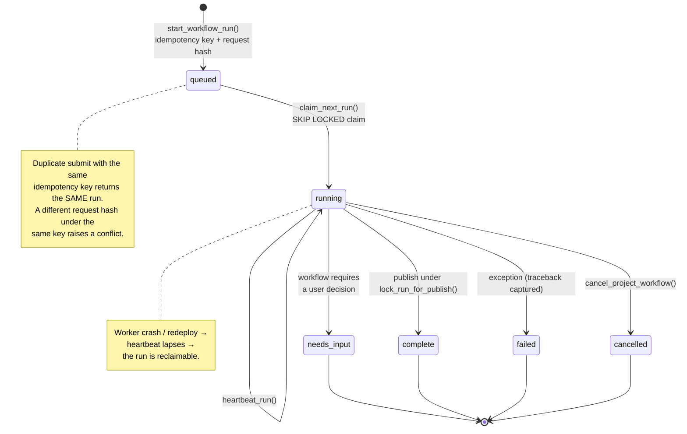
```mermaid
stateDiagram-v2
    [*] --> queued: start_workflow_run()<br/>idempotency key + request hash
    queued --> running: claim_next_run()<br/>SKIP LOCKED claim
    running --> running: heartbeat_run()
    running --> needs_input: workflow requires<br/>a user decision
    running --> complete: publish under lock_run_for_publish()
    running --> failed: exception (traceback captured)
    running --> cancelled: cancel_project_workflow()
    needs_input --> [*]
    complete --> [*]
    failed --> [*]
    cancelled --> [*]

    note right of queued
        Duplicate submit with the same
        idempotency key returns the SAME run.
        A different request hash under the
        same key raises a conflict.
    end note

    note right of running
        Worker crash / redeploy →
        heartbeat lapses →
        the run is reclaimable.
    end note
```

### 10.2 Optimistic concurrency on project state

Every run request carries the state it *expects*:

```mermaid
sequenceDiagram
    participant UI as Cockpit / agent
    participant API as start_workflow_run
    participant DB as Postgres

    UI->>API: start(expected_snapshot_fingerprint,<br/>expected_profile_revision,<br/>expected_decision_set_revision,<br/>expected_artefact_version)
    API->>DB: read current snapshot
    alt state matches
        API->>DB: INSERT workflow_run(run_brief = FROZEN snapshot)
        API-->>UI: run queued
    else state moved
        API-->>UI: 409 — profile/decisions changed,<br/>re-read and retry
    end
```

The `run_brief` freezes the entire project snapshot at enqueue time, so a worker
picking the job up ten minutes later generates against exactly the state the
user saw — not against whatever the project has drifted into since.

`projects.project_context_version` is the authoritative revision for structured
generation context. It advances once for an effective profile, decision or
shared-project-object transaction. `projects.event_sequence` is a separate audit
cursor and continues to advance for workflow, draft, export and other
operational events without invalidating project context.

Snapshot construction uses a bounded optimistic read/check/retry cycle so a
context commit between its component queries cannot publish a torn snapshot.
When a new run is inserted, the API locks the Project row and rechecks that the
snapshot context revision is still current. The run stores that value in
`frozen_project_context_version` as well as in its JSON brief; the worker rejects
any mismatch between the column, snapshot and generation context before
dispatch. Idempotent replay is checked first, so replaying an already-queued run
still returns the original frozen execution after live context advances.

### 10.3 Worker loop

```mermaid
flowchart TB
    start(["Worker boot"]) --> claim["claim_next_run()<br/>FOR UPDATE SKIP LOCKED"]
    claim -->|none| idle["sleep, poll"] --> claim
    claim -->|run| hydrate["_frozen_project(run)<br/>rebuild Project + snapshot<br/>from run_brief"]
    hydrate --> disp["_dispatch → workflow implementation"]
    disp --> prev["on_preview → progress events<br/>streamed to the cockpit"]
    prev --> disp
    disp -->|ok| lock["lock_run_for_publish()"]
    lock --> pub["Write draft_artifact,<br/>attach to procurement request,<br/>sync cost plan revisions"]
    pub --> done["complete_workflow_run()"]
    disp -->|cancelled| roll["rollback →<br/>mark_cancelled_after_rollback()"]
    disp -->|error| fail["fail_workflow_run()<br/>traceback persisted"]
    done --> claim
    roll --> claim
    fail --> claim
```

`SKIP LOCKED` claiming means the worker fleet scales horizontally without a
distributed lock service. Two known open issues are tracked rather than papered
over: a projects-row FK/`FOR UPDATE` deadlock under concurrent launch, and the
absence of a reaper for agent turns stranded by an abrupt worker death.

---

## 11. Project state model

```mermaid
flowchart TB
    subgraph snapshot["ProjectSnapshot — the unit of consistency"]
        prof["<b>Profile</b><br/>building_class · subclasses ·<br/>work_type · state · scale fields<br/><i>profile_revision</i>"]
        dec["<b>Decisions</b><br/>project decisions, lockable<br/><i>decision_set_revision</i>"]
        ident["<b>Identity</b><br/>client · owners · site address<br/>+ confidence + provenance"]
        fp["<b>fingerprint</b><br/>hash over the whole snapshot"]
    end

    snapshot --> caps["Capability matrix (§7.1)"]
    snapshot --> prompt["Agent prompt context"]
    snapshot --> occ["Optimistic concurrency<br/>on workflow start"]
    snapshot --> gate["Overlay gate:<br/>ready / missing / invalid / tbc"]
```

The **three-overlay declaration** — building class, work type, state — is the
project's type signature. It selects which platform knowledge applies, which
taxonomy branch is in play, which workflows unlock, and which section contracts
a document must satisfy. `app/sitewise/gate.py` distinguishes *missing* from
*TBC* from *unsupported*, so the UI and the agent can say precisely what is
blocking rather than "please complete your profile."

**Decisions** are first-class, lockable records. A locked decision is a
commitment the agent may read and cite but must not silently revise —
professional judgement, pinned.

---

## 12. Data architecture

```mermaid
erDiagram
    USERS ||--o{ PROJECTS : owns
    PROJECTS ||--o{ WORKSPACE_FILES : contains
    PROJECTS ||--o{ SOURCE_DOCUMENTS : "ingested evidence"
    SOURCE_DOCUMENTS ||--o{ DOCUMENT_CHUNKS : "chunked + embedded"
    PROJECTS ||--o{ PROJECT_DECISIONS : records
    PROJECTS ||--o{ PROJECT_PROFILE_PROPOSALS : "pending review"
    PROJECTS ||--o{ WORKFLOW_RUNS : queues
    WORKFLOW_RUNS ||--o{ DRAFT_ARTIFACTS : publishes
    DRAFT_ARTIFACTS ||--o{ ARTEFACT_EXPORTS : renders
    PROJECTS ||--o{ CHAT_THREADS : hosts
    CHAT_THREADS ||--o{ CHAT_MESSAGES : contains
    CHAT_MESSAGES ||--o{ MESSAGE_CITATIONS : cites
    MESSAGE_CITATIONS }o--|| SOURCE_DOCUMENTS : "resolves to"
    CHAT_MESSAGES ||--o{ MESSAGE_WEB_CITATIONS : "cites official web"
    PROJECTS ||--o{ ACTIVITY_EVENTS : traces
    PROJECTS ||--o{ AGENT_TURNS : "capability rows"
    PROJECTS ||--o{ PROCUREMENT_REQUESTS : tracks
    PROJECTS ||--o{ TENDER_JOBS : "TCM (FK only)"
    TENDER_JOBS ||--o{ TENDER_QUOTES : compares
    TENDER_QUOTES ||--o{ TENDER_LINE_ITEMS : extracts
    TENDER_LINE_ITEMS ||--o{ TENDER_MAPPINGS : "maps to"
    TENDER_MAPPINGS }o--|| TAXONOMY_CELLS : "trade x element"
    USERS ||--o| STRIPE_CUSTOMERS : "billing identity"
    STRIPE_CUSTOMERS ||--o{ STRIPE_SUBSCRIPTIONS : entitles
```

Storage split, deliberately:

| Store | Holds | Why |
| --- | --- | --- |
| Supabase Postgres | All structured state, embeddings (pgvector), FTS indexes | One transactional source of truth; retrieval co-located with the data it describes |
| Supabase Storage | Canonical uploaded document bytes | Durable, versioned, and **never** exposed to the agent as a filesystem |
| Agent workspace volume | Scratch files, generated artefacts, turn prompts | Traversal-safe, per-project, disposable; the only filesystem the agent sees |

---

## 13. Trust boundaries

```mermaid
flowchart TB
    subgraph b1["Boundary 1 — Browser"]
        u["User session"]
    end
    subgraph b2["Boundary 2 — API"]
        jwt["Supabase Auth JWT<br/>→ user identity"]
        own["Project ownership check<br/>on every route"]
        ent["require_active_entitlement()<br/>single billing seam"]
    end
    subgraph b3["Boundary 3 — Agent subprocess"]
        tok["HMAC turn token<br/>uid + pid + tid + exp"]
        scope["mutation_scopes<br/>reserved from intent"]
        fs["Scoped workspace cwd only"]
    end
    subgraph b4["Boundary 4 — Tool call"]
        per["Per-call re-authorisation"]
        val["Boundary validation:<br/>paths, ids, payload schemas"]
    end

    b1 -->|"HTTPS + JWT"| b2
    b2 -->|"env token, no creds"| b3
    b3 -->|"Bearer per call"| b4
    b4 --> data[("Data")]

    style b3 fill:#fff4e6,stroke:#d97706,stroke-width:2px
    style b4 fill:#eef6ff,stroke:#2563eb,stroke-width:2px
```

The design assumption is explicit: **treat the agent subprocess as
semi-trusted.** Prompt injection from an uploaded document is a real attack
vector in this product — a malicious PDF can absolutely try to instruct the
model. The mitigation is not better prompting; it is that a fully compromised
agent still cannot read another tenant's project, cannot reach the database,
cannot write outside its scratch root, and cannot mutate anything without a
live capability row carrying the right scope.

The prompt hardening in `turn_context.py` complements this at a different
layer: the persona explicitly instructs the agent that "the project" means the
construction project and that any repository-oriented instructions it
encounters are addressed to software agents, not to it.

**Billing has exactly one seam.** `require_active_entitlement(session, user)`
plus monthly turn quota. The rule in `AGENTS.md` is blunt — *do not add a second
entitlement seam* — because divergent authorisation paths are how paid features
leak.

---

## 14. Deployment topology

```mermaid
flowchart TB
    dns["sitewise.au"] --> ng

    subgraph vps["VPS · AU-SY Sydney · Dokploy compose"]
        ng["<b>sitewise-web</b><br/>nginx + React bundle<br/>SSE unbuffered for /api/*"]
        api["<b>sitewise-api</b><br/>FastAPI + MCP + Pi CLI<br/>(bundles Pi w/ JVM/ODL)"]
        w1["<b>sitewise-core-workflow-worker</b><br/>app.workflows.worker"]
        w2["<b>sitewise-worker</b><br/>tender.worker"]
        vol[("AGENT_WORKSPACE_ROOT<br/>persistent volume")]
        ng --> api
        api --- vol
        w1 --- vol
    end

    subgraph ext["External"]
        sup[("Supabase<br/>Postgres · Auth · Storage")]
        oai["LLM providers"]
        stp["Stripe"]
    end

    api --> sup
    w1 --> sup
    w2 --> sup
    api --> oai
    w1 --> oai
    w2 --> oai
    api --> stp
```

Operational facts that are load-bearing rather than incidental:

- **nginx must keep `/api/*` and SSE unbuffered.** Buffering silently converts
  a streaming product into a slow request/response product. It is the single
  most common deployment regression.
- **Workers are separate containers.** Generation load cannot starve the API's
  event loop, and workers can be scaled or restarted independently.
- **Dokploy deploys are manual**, and Dokploy environment variables override
  code defaults — a config set in the panel wins over anything in the image.
- **Deployment runbook is `DEPLOYMENT.md`**, not this file. That document is
  written to be executed end-to-end without the operator at the keyboard.

---

## 15. Observability

```mermaid
flowchart LR
    subgraph sources["Emitters"]
        s1["Workflow runs<br/>(trace events)"]
        s2["Agent tool calls<br/>(status_bus)"]
        s3["Document ingest<br/>(stage events)"]
        s4["Profile / decision<br/>mutations"]
    end
    sources --> ae["activity_events<br/>project-scoped, typed,<br/>reference-linked"]
    ae --> feed["ActivityFeed"]
    ae --> trace["WorkflowTracePanel"]
    ae --> strip["Progress strips<br/>(ingest · workflow)"]

    sources --> logs["structlog<br/>structured JSON<br/>+ request access log"]
```

Every event carries `project_id`, `source`, `run_id`, and a
`reference_type`/`reference_id` pair, so the UI can link an event to the exact
artefact, file or run it concerns. This is the substrate for the product's
**used-by marks** — showing which documents a generated draft actually drew on —
which was chosen over live file-flashing because provenance you can inspect
afterwards beats motion you watch once.

---

## 16. Frontend architecture

```mermaid
flowchart TB
    shell["ProjectShell<br/>resizable cockpit layout"]
    shell --> nav["ProjectLeftNav<br/>+ ProjectWorkflowNav"]
    shell --> chat["Chat surface<br/>@ai-sdk/react · tool chips · stop"]
    shell --> main["Main panel (routed)"]

    main --> p1["DocumentRepositoryPanel<br/>+ IngestProgressStrip"]
    main --> p2["ProjectControlBoard<br/>profile · decisions · capabilities"]
    main --> p3["DraftReviewPanel<br/>+ WorkflowDraftPreview"]
    main --> p4["WorkspaceExplorer<br/>+ WorkbookGrid"]
    main --> p5["Tender comparison matrix"]
    main --> p6["ProcurementRequestPanel"]

    boot["/cockpit-bootstrap<br/>single hydration call"] --> shell
```

**Lean workflow panel doctrine.** A workflow panel is *buttons + draft + trace*
— nothing else. Detail lives below the action, not beside it. Panels that
accumulated status widgets, inline summaries and duplicated state were
deliberately deleted. The principle: the user came to the panel to *do* a
thing; everything competing with that action is noise.

**Scaffold-first previews** over token streaming. When a workflow starts, the
document skeleton appears immediately and fills in — because the scaffold is
deterministic and known before the first token is generated (§8). The user sees
the shape of what they are getting from second one.

**Optimistic UI on upload.** Skeleton rows and a staged ETA strip appear on
drop, before the server confirms. Server-side ingest is currently ~20s per
document; the interface acknowledges the drop instantly and reports honest
staged progress rather than an indeterminate spinner.

---

## 17. Glossary

| Term | Meaning here |
| --- | --- |
| **Agentic runtime** | A headless LLM CLI process that reasons in a loop, calling tools until it can answer. Spawned per turn, stateless between turns. |
| **MCP (Model Context Protocol)** | The standard tool-calling protocol between the runtime and SiteWise. Mounted over HTTP at `/mcp`. |
| **Tool bridge** | The authorised boundary exposing domain capabilities as callable tools. The agent's entire world model. |
| **Turn token** | Short-lived HMAC credential binding one agent turn to one `(user, project)` pair. |
| **Mutation scope** | A named write permission (`profile_mutation`) reserved at turn start from analysed user intent. |
| **Capability row** | The `agent_turns` record whose existence authorises writes. Revocable mid-turn, independent of the token. |
| **Grounding** | Requiring every asserted fact to resolve to a retrievable source passage. |
| **Evidence plane** | One of four epistemic sources: project evidence, platform knowledge, official web reference, model prior (§6). |
| **Hybrid retrieval** | Dense (pgvector) + sparse (Postgres FTS) retrieval combined by rank fusion. |
| **Whole-document path** | Retrieval that returns full document text when the question is *about a document*, not about passages within one. |
| **Scaffold** | The deterministic document skeleton — sections, order, computed tables — generated before any LLM call. |
| **Section contract** | The declared obligations of a named document section: what it must contain and what evidence it owes. |
| **Assembler** | The merge step splicing validated narrative into the scaffold's placeholders. |
| **Coverage gate** | Advisory check that a workflow's declared required corpus was consulted; emits Annexure A. |
| **Census verification** | Deterministic enumeration of every numeric token on a page, used to reject extracted figures that do not appear on it. |
| **Ledger reconciliation** | Summing extracted line items and checking them against the bidder's own stated totals. |
| **Silence analysis** | Detecting what a bidder did *not* price — the commercially dangerous omission. |
| **Snapshot fingerprint** | Hash over the full project snapshot, used for optimistic concurrency on workflow start. |
| **Three-overlay declaration** | Building class + work type + state. The project's type signature; selects knowledge, taxonomy and capabilities. |
| **Determinism boundary** | The enforced line between stochastic (LLM) and deterministic (Python) components (§2). |

---

## 18. Governing documents

| Concern | Authority |
| --- | --- |
| Coding rules, stack lock, dependency policy | `AGENTS.md` (plus `backend/AGENTS.md`, `frontend/AGENTS.md`) |
| Deployment and recovery | `DEPLOYMENT.md` |
| Agent runtime | `docs/plans/2026-08-04-pi-only-agent-runtime.md` |
| Tender Comparison internals | `docs/plans/2026-06-11-tender-comparison-module-prd.md` |
| System shape (this document) | `docs/architecture.md` |

Pi is the sole agent runtime. July Hermes foundation plans under
`docs/plans/hermes-foundation/` are historical implementation records only.

### Status

In place: MCP bridge and turn tokens, Pi runtime and SSE relay, chat UI,
Tender Comparison MCP path, workspace/artefact editing, Stripe entitlements.

Open gates: live `sitewise.au` production acceptance, then legacy grounded-RAG
cutover.

### Deletion rules

The legacy grounded-RAG path is a deliberate safety valve, not dead code. Do not
delete before live production acceptance and the legacy cutover gate pass:

- `backend/app/chat/orchestrator.py`
- `backend/app/assistant/*`
- Cockpit pages and routes still serving as fallbacks

After production acceptance passes, remove them in small, revertable commits
with backend and frontend checks green.
