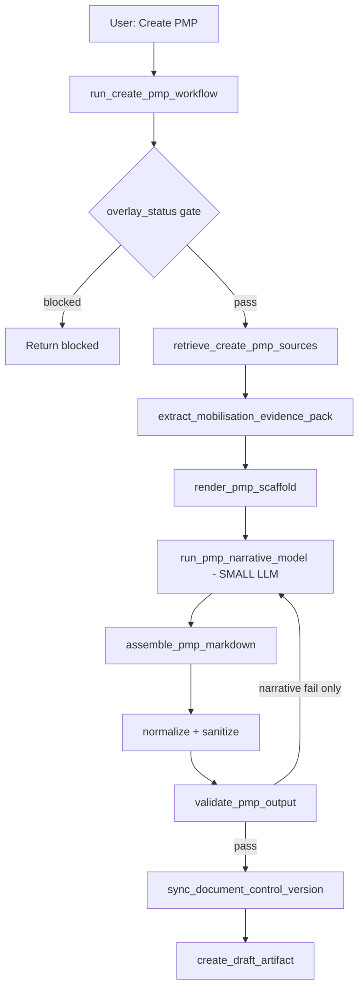

# SiteWise Document Compiler — Hybrid Workflow PRD

## Executive summary

Create PMP (and future SiteWise deliverables — cost plan, RFP, tender evaluation, etc.) must produce **reviewable drafts in seconds, not minutes**, with **evidence-faithful facts** and **consistent scaffold depth**. The current approach asks a single LLM call to rewrite the entire document from doctrine, seeds, and project evidence. That is slow (30–90+ seconds), expensive, flaky across retries, and hard to scale to many workflow types.

**Decision:** adopt a **hybrid document compiler** (Option 3):

1. **Extract** structured facts from project evidence (code-first).
2. **Render** the standard SiteWise scaffold from templates (code-first, no LLM).
3. **Generate** only judgment-heavy slices via a **small** LLM call (recommendations, register rows, risk narrative).
4. **Validate, sanitize, version, and save** using the existing Clerk workflow QA layer.

**Do not** replatform core generation on the Cursor SDK. Composer quality observed in Cursor IDE chat is not what hosted workflows run today (`gpt-4o-mini` via pydantic-ai). Cursor SDK may be used later for optional **human-triggered refine**, not first-draft generation.

---

## Problem statement

### User pain

- **Speed:** Create PMP is too slow for market adoption. Users will not wait ~60s for a first draft when they expect near-instant assembly from known inputs.
- **Quality variance:** Full-doc LLM generation contradicts indexed evidence (“not yet filed” when engagement letter is on file), misses key evidenced facts (e.g. September 2026 DA target), and under-fills audit/register requirements.
- **Iteration fatigue:** A dozen prompt/validation tuning cycles did not converge because the **architecture fights itself** (greenfield content contract vs evidence-grounded rules in the same prompt).

### Product context

Clerk is building **many similar artifacts** after PMP: cost plan, RFP, tender evaluation, consultant procurement, etc. Each shares:

- SiteWise three-overlay gate (archetype, role, state)
- Doctrine + seed authority stack
- Project evidence with Assumption labelling
- Versioned draft artefacts with provenance
- Evidence map + internal audit layer

A **repeatable compiler pattern** scales; per-workflow mega-prompts do not.

---

## Background — what was tried (June 2026 session)

### Observed failure mode (Test Project 112, Harrison Clarke evidence)

With engagement letter + fee proposal on file, early drafts still said:

- “Engagement instruments — all Assumption: not yet filed”
- “Neither brief filed yet”
- Generic planning pathway when fee proposal states **DA assumed (not CDC)**
- Missing **target DA lodgement September 2026** from engagement letter
- Missing **Linden Constructions** conflict disclosure from fee proposal

Root cause: `build_greenfield_brief()` injected “not yet filed” / “pre-brief” defaults even in `evidence_grounded` mode, conflicting with evidence rules in `_role_drafting_note()`.

### Phase 1 fixes (implemented before this PRD)

| Change | Location |
| --- | --- |
| `ARCHITECT_PM_EVIDENCE_GROUNDED_SECTION_BRIEFS` | `backend/app/sitewise/pmp_greenfield_brief.py` |
| `draft_mode` passed to `build_greenfield_brief()` | `backend/app/workflows/create_pmp.py` |
| Full-document contradiction validation | `backend/app/sitewise/pmp_evidence_validation.py` |
| Expanded sanitize across body sections | same |
| `sync_document_control_version()` at save | same + `create_pmp.py`, `update_pmp.py` |

**Result:** Draft v09 on Test Project 112 was materially better — post-engagement posture, grounded overview, two-brief discipline, PI/fee/conflict disclosure. Still missing: September DA target, register rows table, Judgements, pessimistic evidence map rows, fee staging detail.

Phase 1 improved **prompt honesty and QA**; it did not fix **speed** or **deterministic fact assembly**.

---

## Strategic options considered

| Option | Description | Verdict |
| --- | --- | --- |
| **A — Keep tuning full-doc LLM** | More instructions, validation, retries | **Reject** — diminishing returns; 3× full regen on failure |
| **B — Cursor SDK as workflow engine** | Call Composer 2.5 programmatically for entire PMP | **Reject for core path** — vendor lock-in, latency (esp. cloud), weak deterministic QA; does not inherently fix speed |
| **C — Hybrid document compiler** | Template + extraction + small LLM | **Accept** — matches CA office practice; scales to all artifacts |
| **D — Cursor SDK for refine only** | Optional “Improve draft” button | **Defer** — post-MVP enhancement |

### Cursor SDK note

- Packages: `@cursor/sdk` (TypeScript), `cursor-sdk` (Python); model id `composer-2.5`.
- Clerk workflows today use **OpenAI** via `pydantic_ai.Agent` and `run_agent_with_retry` — see `backend/app/assistant/chat_models.py`, default `gpt-4o-mini`.
- SDK is appropriate for ad-hoc agent tasks, not the regulated first-draft pipeline.

---

## Solution — hybrid document compiler

### Civil-engineering analogy

1. **Extract** — CA reads engagement letter and fee proposal; fills a fact sheet (not the whole PMP).
2. **Render** — print standard SiteWise forms (due diligence checklist, RACI, sub-milestones) and mail-merge facts.
3. **Narrate** — PM writes only recommendations, action register, and risk notes.
4. **QA** — Clerk validation before issue (same as hold points on site).

### Target flow



### What stays unchanged

| Component | File |
| --- | --- |
| Workflow entry + trace | `backend/app/workflows/create_pmp.py` → `run_create_pmp_workflow` |
| Three-overlay gate | `backend/app/sitewise/gate.py` |
| Source retrieval | `retrieve_create_pmp_sources` in `create_pmp.py` |
| Section headings contract | `backend/app/sitewise/pmp_sources.py` → `required_section_headings` |
| Scaffold spec (tables, checklists) | `backend/app/sitewise/pmp_greenfield_brief.py` |
| Evidence QA | `backend/app/sitewise/pmp_evidence_validation.py` |
| Draft persistence | `backend/app/database/draft_artifacts.py` |
| Cockpit API | `backend/app/api/projects.py` → `POST .../workflows/create-pmp` |

### What is replaced or shrunk

| Current | Hybrid |
| --- | --- |
| `run_create_pmp_model` — one huge prompt, full markdown out | Split into extract → render → small narrative → assemble |
| `create_pmp_instructions.md` “write everything” | Instructions only for **narrative slice** |
| Up to 3× **full document** validation retries | Retry **narrative slice** only; scaffold is deterministic |
| LLM invents due diligence tables | Template renders tables every time |

### New modules (proposed)

| Module | Responsibility |
| --- | --- |
| `backend/app/sitewise/mobilisation_evidence.py` | Parse engagement letter + fee proposal → `MobilisationEvidencePack` |
| `backend/app/sitewise/pmp_renderer.py` | Template mail-merge → ~70–80% markdown scaffold |
| `backend/app/workflows/pmp_narrative.py` | Small pydantic-ai agent → judgements, recommendations, register rows |
| `backend/app/sitewise/pmp_assembler.py` | Combine scaffold + narrative; set provenance fields |

Wire from `run_create_pmp_workflow` behind feature flag `PMP_HYBRID_COMPILER=1` (env), legacy path as fallback until stable.

---

## MobilisationEvidencePack — field spec

Structured output from project evidence (extend over time; align with CPI-017 metadata extraction).

### Identity & site

| Field | Source (Harrison Clarke fixture) |
| --- | --- |
| `owners` | Michael and Sarah Chen |
| `site_address` | 14 Wattle Grove, Lindfield NSW 2070 |
| `dwelling_summary` | Class 1a knockdown-rebuild, ~285 m² GFA, 4 bed + study, double garage |
| `site_constraints` | 650 m² lot, ~2.1 m fall; Ku-ring-gai LEP 2015 / DCP 2010; HCA adjoining, no heritage item on title |

### Engagement

| Field | Source |
| --- | --- |
| `engagement_letter_date` | 14 May 2026 |
| `engagement_executed_date` | 16 May 2026 (acceptance signatures) |
| `appointee` | Harrison Clarke Studio Pty Ltd |
| `roles` | Architect-PM; not Superintendent/Certifier; CA per engagement |
| `scope_bullets` | From engagement letter §Scope of services |
| `service_exclusions` | Interior beyond joinery, landscape, geotech/survey coordination, extra tender rounds, legal advice, etc. |
| `disbursements` | Cost + 10% |
| `owner_approval_rule` | No commitment without written approval except routine consultant coordination |

### Fee & programme

| Field | Source |
| --- | --- |
| `fee_total_ex_gst` | $148,500 |
| `fee_stages` | Mobilisation $22k → CA $8k/mo × 12 (full table from letter) |
| `reporting_cadence` | Monthly owner progress reporting |
| `target_da_lodgement` | September 2026 |

### PI insurance

| Field | Source |
| --- | --- |
| `pi_insurer` | QBE Australia Ltd |
| `pi_policy_ref` | PI-NSW-2026-44821 |
| `pi_limit` | $5,000,000 any one claim |
| `pi_period` | 1 Jul 2025 – 30 Jun 2026 |
| `pi_holder` | HCS (holder, not insurer) |

### Procurement

| Field | Source |
| --- | --- |
| `planning_pathway` | DA assumed; CDC not assumed (fee proposal) |
| `invited_builder_count` | 3 |
| `formal_tender_count` | 1 |
| `ca_months_assumed` | 12 |
| `conflict_disclosure` | Linden Constructions Pty Ltd (2019, 2023); declare before tender list lock |

### Gaps (always explicit when absent)

- Owner project brief formal sign-off  
- Construction budget  
- Geotechnical report  
- Certifier appointment  
- Master programme on file  

### Extraction approach

1. **Phase 1:** regex + section parsing on `normalized_content` (markdown evidence). Reuse anchors from `extract_project_grounding_facts` in `pmp_evidence_validation.py`.
2. **Phase 2:** shared extractor framework with CPI-017 for PDF/Word engagement packs.

---

## PMP scaffold renderer — section coverage

Renderer must produce all `required_section_headings("architect-pm")` with content from `pmp_greenfield_brief.py` / `ARCHITECT_PM_EVIDENCE_GROUNDED_SECTION_BRIEFS` when `evidence_grounded`.

| Section | Renderer (deterministic) | Narrative LLM |
| --- | --- | --- |
| Evidence basis and document control | Yes — evidence on file, gaps, evidence map | No |
| Project overview | Yes — from pack | No |
| Architect-PM role and appointment | Yes — role table, scope, PI, builder checklist | No |
| Two-brief discipline | Yes | No |
| Governance and decisions | Yes — RACI + gates + approval note | No |
| Communications protocol | Yes — cadence + escalation format | No |
| Fee, services and programme relationship | Yes — fee table, exclusions, tender assumptions | No |
| Scope and change control | Yes — draft scope from pack | No |
| Approvals and compliance | Yes — due diligence + authority tracker (+ BASIX row NSW) | No |
| Programme and staging regime | Yes — 3-stage + sub-milestones + **DA target date** | No |
| Cost, programme and procurement posture | Yes — contingency posture, Linden conflict | No |
| Consultant coordination | Yes — tracker table (Architect appointed) | No |
| Risks, decisions and next actions | Partial — risk **table skeleton** | Yes — risk wording, owner decisions |
| Internal audit layer | Facts from pack (deterministic) | Yes — Judgements, Recommendations, register rows, workflow warnings |

---

## Narrative LLM — bounded contract

### Input (small prompt)

- `MobilisationEvidencePack` as JSON or bullet summary  
- `gaps` list  
- Mobilisation run date (ISO) for due dates  
- Archetype/role/state  

### Output (structured pydantic model)

```python
class PmpNarrativeOutput(BaseModel):
    judgements: list[str]          # min 2
    recommendations: list[str]     # min 3; each with owner ask + ISO due date
    register_rows: list[RegisterRow]  # ID, description, owner, status, due_date, source, next_action
    risk_rows: list[RiskRow]       # optional if not fully templated
    workflow_warnings: list[str]   # real gaps only
```

### Constraints

- **Max output tokens:** target 800–1,500 (not 4,000+).  
- **Retries:** only on narrative validation failure, max 2.  
- **Model:** fast allowlisted model default (`gpt-4o-mini` or `gpt-4.1-nano`); user override via existing `chat_model` on request.

---

## Quality bar — acceptance criteria (Test Project 112)

Use synthetic evidence:

- `data/synthetic-mobilisation-evidence/01-engagement-letter-harrison-clarke-studio.md`
- `data/synthetic-mobilisation-evidence/02-fee-proposal-harrison-clarke-studio.md`

Reference faithful draft patterns in `backend/tests/workflows/test_create_pmp.py` → `_valid_evidence_grounded_pmp_markdown()`.

### Must pass (automated)

- [ ] All `required_section_headings("architect-pm")` present  
- [ ] `evidence_grounded_violations()` empty after sanitize  
- [ ] `greenfield_structure_violations()` empty  
- [ ] Document control `Version vNN` matches draft artefact version  
- [ ] No contradiction phrases with engagement letter + fee proposal in evidence_refs  

### Must contain (content)

- [ ] Owners, site, knockdown-rebuild narrative from fee proposal  
- [ ] Engagement executed **16 May 2026** (or explicit acceptance date)  
- [ ] Fee $148,500 ex GST **with stage breakdown**  
- [ ] PI: QBE, $5M (holder = HCS)  
- [ ] DA pathway assumed; **not** generic “CDC vs DA unknown” only  
- [ ] Target DA lodgement **September 2026**  
- [ ] Linden Constructions conflict disclosure  
- [ ] Three invited builders, one formal tender  
- [ ] Two-brief: engagement on file; owner brief draft pending sign-off  
- [ ] Internal audit: ≥2 Facts; ≥3 Recommendations with dates; **register rows table**; Judgements present  
- [ ] BASIX in authority tracker (new-dwelling NSW)  

### Performance (target)

- [ ] Scaffold render + extract: **< 500 ms** (no LLM)  
- [ ] End-to-end Create PMP (hybrid): **< 15 s** p95 on dev hardware (single narrative LLM call)  
- [ ] Legacy full-doc path remains behind flag for comparison until hybrid is default  

---

## Implementation phases

Execute **one phase per agent session** to preserve context.

| Phase | Deliverable | Key files |
| --- | --- | --- |
| **1** | `MobilisationEvidencePack` + extractor + unit tests (Harrison Clarke) | `mobilisation_evidence.py`, `tests/sitewise/test_mobilisation_evidence.py` |
| **2** | `render_pmp_scaffold()` + snapshot tests | `pmp_renderer.py`, tests |
| **3** | `PmpNarrativeOutput` agent + instructions | `pmp_narrative.py`, `pmp_narrative_instructions.md` |
| **4** | `assemble_pmp_markdown` + wire `run_create_pmp_workflow` | `pmp_assembler.py`, `create_pmp.py` |
| **5** | Feature flag, legacy fallback, integration test, make hybrid default | `config.py`, tests |
| **6** | Replicate pattern for Create Cost Plan | `create_cost_plan.py`, `cost_plan_brief.py` |

### Agent handoff prompt (Phase 1)

> Implement PMP hybrid Phase 1 per `docs/plans/2026-06-08-sitewise-document-compiler-hybrid-prd.md`: `MobilisationEvidencePack` extractor from engagement letter + fee proposal; unit tests against Harrison Clarke synthetic evidence. Do not wire into workflow yet.

---

## Future workflows — same compiler pattern

| Workflow | Extractor inputs | Template spec |
| --- | --- | --- |
| Create cost plan | Claims, budget, contract sums | `cost_plan_brief.py` |
| RFP / tender docs | Brief, scope, evaluation criteria | TBD |
| Tender evaluation | Submissions, matrix | TBD |
| Update PMP | Baseline draft + evidence delta | Re-render changed sections only |

Shared abstractions (future):

- `DocumentSpec` — sections + tables  
- `EvidencePack` — workflow-specific facts  
- `render_draft(spec, pack, mode)`  
- `run_narrative_model(spec.narrative_contract, pack, gaps)`  

---

## UI / product notes

- Stream progress steps in cockpit: “Extracting evidence → Assembling scaffold → Drafting recommendations → Saving draft.”  
- Concurrent workflows (Create PMP + Create cost plan) are **allowed** — separate `workflow_type` drafts; separate running flags in UI.  
- Do not block PMP while cost plan runs; warn about shared LLM quota only.

---

## Risks and mitigations

| Risk | Mitigation |
| --- | --- |
| Extractor fails on non-markdown PDF evidence | CPI-017; fallback to partial pack + Assumption rows; optional small LLM extract for unknown doc shapes |
| Template drift from doctrine updates | Single source: `pmp_greenfield_brief.py`; renderer imports checklist strings |
| Narrative still slow | Cap tokens; fast model; async job + notification later if needed |
| Over-engineering before second workflow | Phase 1–5 for PMP only; generalize after cost plan copy |

---

## References (codebase)

| Topic | Path |
| --- | --- |
| Create PMP workflow | `backend/app/workflows/create_pmp.py` |
| PMP instructions (legacy full-doc) | `backend/app/workflows/create_pmp_instructions.md` |
| Greenfield / evidence-grounded briefs | `backend/app/sitewise/pmp_greenfield_brief.py` |
| Evidence validation | `backend/app/sitewise/pmp_evidence_validation.py` |
| Gold test markdown | `backend/tests/workflows/test_create_pmp.py` |
| Harrison Clarke fixtures | `data/synthetic-mobilisation-evidence/` |
| Metadata extraction (related) | `docs/issues/.../CPI-017-port-practice-document-metadata-extraction.md` |
| Implementation issue | `docs/issues/.../CPI-019-implement-pmp-hybrid-document-compiler.md` |

---

## Revision history

| Date | Change |
| --- | --- |
| 2026-06-08 | Initial PRD from Create PMP quality/speed review session; Phase 1 validation fixes documented; hybrid compiler adopted |
