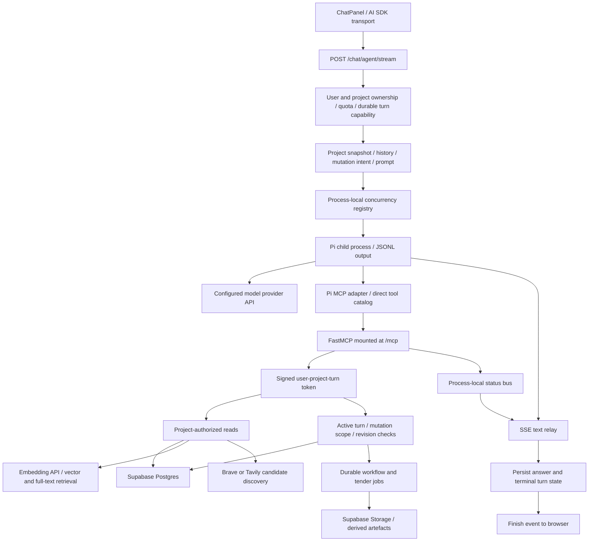

# Pi, MCP and backend lifecycle review — 17 September 2026

## Conclusion and scope

The reported screenshot shows partial assistant text followed by the application's
interruption fallback. It does **not** establish that Pi's MCP configuration caused
the incident. That same saved message could also be produced by an unexpected
streaming exception. No incident-specific runtime logs or authenticated live turn
were available in this review, so the original production cause remains unconfirmed.

Reviewed the current working tree, including its substantial pre-existing changes.
This review adds targeted lifecycle fixes and regression tests; it does not replace
Pi, alter models, deploy, or execute the screenshot's procurement instruction.

## Execution and data map

The agent's tools call backend domain services directly through MCP. They do not
generally make another HTTP request to the frontend's REST endpoints. REST and MCP
share services such as `app/procurement/strategy.py`; their authorization entry
points differ. FastMCP's lifespan is mounted in the application lifespan.

| Data surface | Agent entry points | Backend destination and boundaries |
|---|---|---|
| Project context | Profile, snapshot, next-actions, capabilities, shared-knowledge tools | Project services and Postgres; scoped project ownership; mutation capabilities for writes |
| Project evidence | Document register, find text, search documents, get document | Stored document text; retrieval uses OpenAI embeddings plus Postgres vector/full-text search |
| Platform guidance | List/search/read platform knowledge | Shared platform corpus, distinct from project evidence |
| Procurement Strategy | Get/refresh/apply strategy operations | Canonical procurement tables; required mutation scope; row locking and expected revision |
| Consultant discovery | `search_procurement_candidates` | Brave/Tavily commercial search, with the government-domain restriction removed specifically for discovery; no database write |
| Official web references | Search/read web source, attach official instrument | Separate web-research policy and attachment service |
| Cost plan, programme, document blocks | Typed read/apply tools | Shared domain services, validated operations, revision checks, derived artefacts |
| Long document/tender work | Start/status/result/cancel tools | Durable workflow or tender jobs; separate from the lifetime of the chat process |
| Correspondence | Search/read email, draft/reply/forward tools | Project email services; drafting is separate from sending |

## Confirmed defects fixed here

1. **Silent SSE intervals.** The relay waited indefinitely for text or a tool
   status event. Added a 15-second SSE comment heartbeat while waiting. The test
   pauses work, receives a heartbeat, then releases work and verifies completion
   without cancellation. This mitigates idle connection drops; it does not make
   execution survive an actual browser disconnect or server restart.
2. **Internal failure misreported as interruption.** The relay emitted an error
   and `[DONE]` for an unexpected exception, then returned without telling the
   route why. The route saved the generic interruption fallback. The relay now
   propagates a sanitized `PiTurnError`; the route saves its failure before sending
   terminal error events. The regression injects a failure after partial text,
   checks saved/browser messages agree, and checks private details are absent.
3. **Success signalled before persistence.** The route previously saved the
   assistant message and completed the durable turn after streaming `finish` and
   `[DONE]`. The relay now invokes completion persistence before terminal success.
   Tests close the consumer at `finish`, verify the commit already happened, and
   verify a persistence error cannot emit successful completion. Pending status
   readers are also cancelled and drained before terminal events.
4. **Prompt/catalog mismatch.** Instructions require `get_workflow_capabilities`
   and advertise `get_project_next_actions`, but neither was in Pi's direct tool
   catalog. Both read tools are now included. This removes the mismatch without
   relying on any adapter gateway fallback. It is not established as the cause of
   the reported procurement interruption.

The first three new regressions failed on the starting implementation. The
direct-catalog regression also failed before its fix. Existing subprocess timeout,
large JSONL-reader, queue-budget and turn-token changes were already present and
are not attributed to this review.

## Procurement request traced

Expected sequence: read the strategy and current revision; determine the location
from confirmed project context; search `consultant.architect` and
`consultant.civil` using the canonical discipline codes; apply six candidate-slot
updates with provenance against the current revision; report the returned result.
The discipline catalog, rather than free-text role names, governs actual tool input.

The exact screenshot wording is now covered by a route regression and grants
`procurement_strategy_mutation`. All 78 configured direct tool names (75 ordinary
and 3 optional web tools) are registered in FastMCP. Candidate search remains
advertised when web research is disabled, but returns an explicit configuration
error; that is different from a missing tool or unavailable tenderer slots.

Search provider requests use the configured bounded HTTP timeout (default 12 s).
The overall Pi deadline defaults to 360 s, queue timeout to 30 s, and token/capability
expiry includes queue time plus a 30 s margin. The checked-in nginx upstream
read/send timeouts are 600 s with buffering disabled. These are source defaults,
not confirmation of deployed values or of any outer proxy's idle timeout.

## Remaining findings and priorities

| Priority | Finding | Required follow-through |
|---|---|---|
| P1 | Chat execution is owned by the streaming HTTP task. A real disconnect/cancellation terminates the Pi process tree. Existing workflow jobs are durable, but an arbitrary multi-step research chat turn is not. | Introduce supervised turn execution with durable event replay/reconnect, explicit Stop revocation, restart reconciliation and mutation fencing. Exercise disconnect during read/search/write and never blindly replay a possibly committed mutation. |
| P1 | Tool observability is incomplete. Of 91 registered tools, only 27 directly use `_tool_status`; others have resource events, delegated reporting, or no equivalent call trace. Source-trace counts include selected successful status events and deduplicate tool names. | Add a common correlated tool-call boundary with call ID, turn ID, tool name, duration, outcome and committed revision. Include provider timing/error class without secrets, prompts or raw document content. Do not interpret “1 tool used” as one actual MCP invocation. |
| P2 | Failure persistence revokes the turn, whose status becomes `cancelled`/`not_started`, even when the cause is a provider or timeout failure. | Separate execution outcome from authorization revocation in durable status; retain safe failure phase and reason. |
| P2 | `stream_pi_turn` accepts zero process exit plus any emitted text, without requiring a terminal `agent_end`. Assistant `aborted` is not treated like `error`. | Replay actual pinned Pi JSONL for complete, aborted, tool-only and abruptly truncated turns; tighten terminal-success recognition without rejecting legitimate event sequences. |
| P2 | Candidate research keeps its authorization SQL session open while awaiting the external search API. Some retrieval tools also hold a SQL session across embedding/provider work. | Release read-only authorization transactions before external work where safe; reauthorize at mutation boundaries. Measure pool wait under concurrent turns before broad changes. |
| P2 | Turn registry, semaphore and status bus are process-local; MCP HTTP sessions are also stateful. | Retain the current single-API-process topology until cross-process routing, cancellation, status delivery and durable capacity are proven. More Uvicorn workers is not a safe shortcut. |
| P2 | Mutation commit and tool response are separate events. Procurement writes commit before building/publishing their response snapshot. | Test response failure after commit. Re-read revision/state on uncertain outcomes; preserve provenance and do not retry writes as new operations. |
| P3 | Canonical docs referenced by AGENTS.md are absent in this checkout, including architecture, Pi-runtime plan, domain context and the indicated TCM PRD. | Restore/reconcile the documented source of truth. Current source and repository instructions were used for this review. |

## Verification and incident acceptance

Final verification: **447 passed, 4 skipped** across `tests/agent`,
`tests/mcp_bridge`, `tests/procurement`, `tests/web_research` and
`tests/billing/test_usage.py`. Ruff passed for all seven changed Python files;
`git diff --check` found no whitespace errors in those files. Pytest reported its
existing AnyIO import-rewrite warning. Commands ran from `backend/` with
`uv run --frozen --cache-dir .uv-cache` and no live provider/database access.

Offline tests cover agent streaming/subprocess behavior, tool discovery, MCP
authorization, procurement operations, research provider adapters and turn usage.
They do not prove live adapter discovery, provider availability, real database
locking, proxy behavior or successful completion of the user's actual project.

For the reported incident, correlate `agent_stream_start`, `agent_stream_cancelled`,
`agent_stream_timeout`, `agent_stream_failed` and `agent_stream_persisted` by turn ID.
Match the same interval against API restart/deploy and proxy logs. Check deployed
build, selected provider/model, web-research configuration and durable turn state.
Reproduce with a disposable strategy fixture and observe the read → two searches
→ six candidate updates → saved completion sequence, then repeat with a deliberate
connection drop. Production acceptance remains open until that evidence exists.

No dependencies, migrations, frontend behavior or production configuration were
changed in this review.
